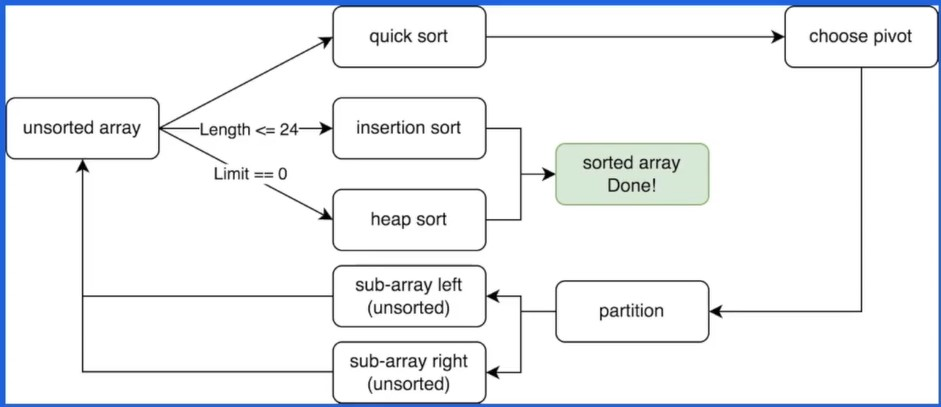
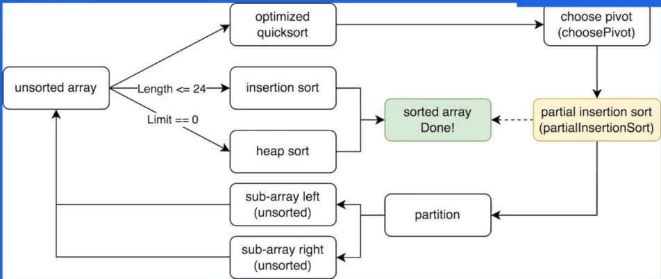
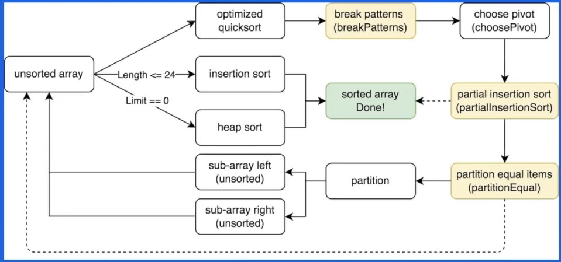

# Go1.19排序算法实践

## 01 经典排序算法

- 由于这些经典排序算法在《数据结构和算法》这门课中已经充分介绍了，所以这里仅简要表达。

### 插入排序

- 将元素不断插入已经排序好的 `array` 中。

- 优点：最好情况时间复杂度为 `O(n)` 。

  缺点：平均和最坏情况的时间复杂度高达 `O(n^2)` 。

### 快速排序

- **分治思想**：不断分割序列直到序列整体有序：

  1. 选定一个 `pivot` ；
  2. 使用 `pivot` 分割序列，分成元素比 `pivot` 大的和元素比 `pivot` 小的两个序列；
  3. 不断分割直到序列整体有序。

- 优点：最好情况和平均情况下时间复杂度为 `O(nlogn)` 。

  缺点：最坏情况的时间复杂度高达 `O(n^2)` ；

### 堆排序

- 利用**堆的性质**形成的排序算法：
  - 构造一个大顶堆；
  - 将根节点（最大元素）交换到最后一个位置，调整整个堆，如此反复。
- 不管在什么情况下，其时间复杂度均为 `O(nlogn)` ，较为稳定。

- 既然不同的排序算法都各有其优缺点，那么能不能**将这些排序算法的优点都结合起来**，形成一种更好的混合排序算法呢？

  答案当然是可以 -> `pdqsort` 。

## 02 从零打造pdqsort

- `pdqsort（pattern-defeating-quicksort）`，是一种不稳定的**混合排序算法**，它的不同版本被应用在 `C++ BOOST`、`Rust` 以及 `Go1.19` 中。它对常见的序列类型做了特殊的优化，使得在不同条件下都拥有不错的性能。

### pdqsort - version 1

- 结合三种排序算法的优点：
  - 对于短序列（小于一定长度，在泛型版本根据测试选定 24）我们使用插入排序；
  - 其他情况，使用快速排序来保证整体性能；
  - 当快速排序表现不佳（当最终 `pivot` 的位置离序列两端很接近时（距离小于`length/8`），判定其表现不佳）时，使用堆排序来保证最坏情况下时间复杂度仍然为 `O(nlogn)`。

### pdqsort - version 2

- 在 `pdqsort - version 1` 的流程图中可以看到，快速排序的 `pivot` 的选择在很大程度上会影响 `pdqsort` 算法的性能，通过改进 `pivot` 的选择策略（在寻找 `pivot` 所需要的开销和 `pivot` 带来的性能优化之间做一个平衡）—— 寻找近似中位数，可以提高 `pdqsort` 的性能。

  则我们可以得到 `pdqsort` 的第二个版本： `pdqsort - version 2`。

  

- `pivot` 选择的优化：
  - 短序列（<=8）：选择固定元素。
    - 注意：对于短序列，我们用的是插入排序，并不使用快速排序。
  - 中序列（<=50）：采样三个元素，`median of three` 。
  - 长序列（>50）：采样九个元素，`median of medians`。

- 另外，`pivot` 的采样方式使得我们有探知序列当前状态的能力：
  - 如果采样的元素都是逆序排序 -> 序列可能已经逆序 -> 翻转整个序列
  - 如果采样的元素都是顺序排序 -> 序列可能已经顺序 -> 使用有限插入排序

### pdqsort - version 3

- 虽然 `pdqsort - version 2` 对选择 `pivot` 做了优化，但是并没有考虑到**重复元素很多**的情况。

- 我们可以做出如下优化：
  1. 如果在 `pivot` 采样时，两次 `partition` 生成的 `pivot` 相同，即 `partition` 进行了无效分割，则此时认为 `pivot` 的值为重复元素（相比上一种方法有更高的采样率），我们就使用 `partitionEqual` 将重复元素排列在一起，减少重复元素对于 `pivot` 选择的干扰。
  2. 当 `pivot` 选择策略表现不佳时，随机交换元素，避免一些极端情况使得 `QuickSort` 总是表现不佳，以及一些黑客攻击情况。

- 通过 `pdqsort` 算法的一步步优化，我们可以回答以下问题：
  1. 高性能的排序算法是如何设计的？
     - 根据不同情况选择不同策略，取长补短。
  2. 生产环境中使用的的排序算法和课本上的排序算法有什么区别？
     - 理论算法注重理论性能，例如时间、空间复杂度等。生产环境中的算法需要面对不同的实践场景，更加注重实践性能。