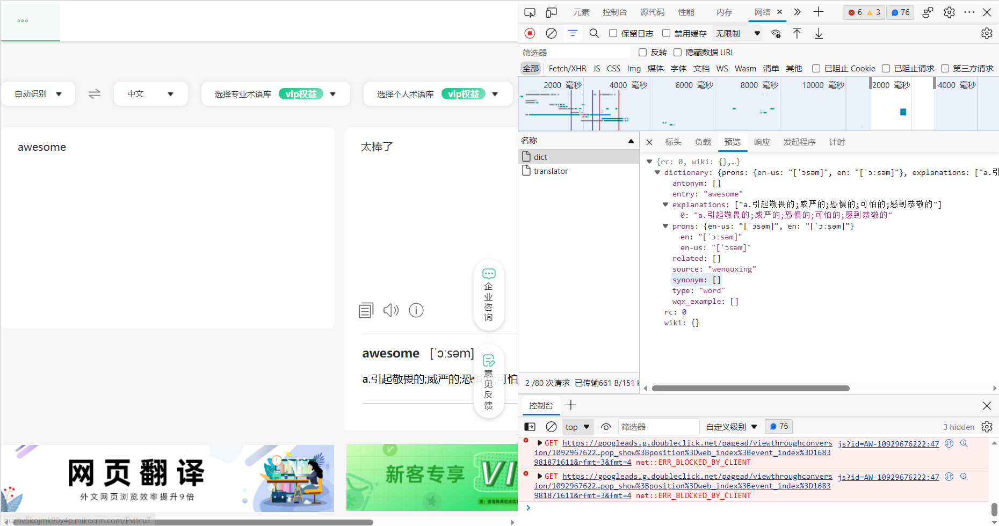
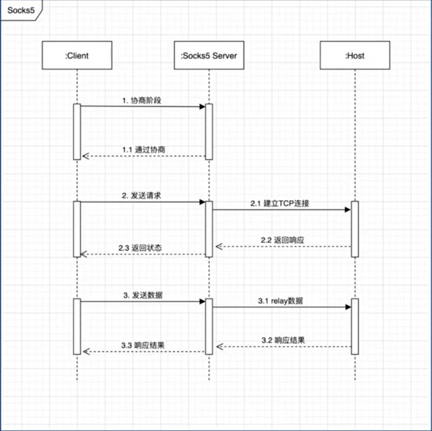

# Go语言基础语法

## Go 语言快速上手 - 基础语言

### 01 简介

#### 1.1 什么是 Go 语言

- Go 语言是谷歌出品的一门通用型计算机编程语言。有以下特性：
  1. 高性能、高并发：内嵌了对高并发的支持
  2. 语法简单、学习曲线平缓
  3. 丰富的标准库
  4. 完善的工具链：编译、代码格式化、错误检查、代码文档、包管理、代码提示
  5. 静态链接
  6. 快速编译
  7. 跨平台：Linux、WIndows、MacOS、Android、ios
  8. 垃圾回收

#### 1.2 哪些公司在使用 GO

- 字节、腾讯、哔哩哔哩、Google、Facebook等

#### 1.3 字节全面拥抱 Go 的原因

1. 最初使用的 Python，由于性能问题换成了 Go
2. C++ 不太适合在线 Web 业务
3. 早期团队非 Java 背景
4. 性能比较好
5. 部署简单、学习成本低
6. 内部 RPC 和 HTTP 框架的推广

### 02 入门

#### 2.1 开发环境

##### 安装 Golang

- 通过以下链接可以下载安装 Golang：

  [The Go Programming Language](https://go.dev/) 

  [Go下载 - Go语言中文网](https://studygolang.com/dl) 

  [七牛云 - Goproxy.cn](https://goproxy.cn/) 

##### 配置集成开发环境

- 可以使用 VScode 作为 Go 的集成开发环境

#### 2.2 基础语法

- 以 “hello world” 为例，介绍 go 的代码组成：

  ```go
  package main
  
  import (
  	"fmt"
  )
  
  func main() {
  	fmt.Println("hello world")
  }
  ```

  - `package main` ：代表这个文件属于 main 包的一部分，是程序的入口文件
  - `import {"fmt"}`：导入了 “fmt” 包，用于向屏幕输入输出字符串、格式化字符串
  - `func main() {fmt.Println("hello world")}`：main 函数，用于向屏幕输出 “hello world” 字符串

##### 变量

- Go 语言是强类型语言。
- Go 语言变量的声明有两种方式：
  1. `var name = value` ：这种方式会自动推导变量的类型
  2. `name := value`

##### 常量

- Go 语言常量的声明方式：`const name = value`：会根据使用的上下文自动确定使用类型

##### if-else

- `if` 后面的条件判断不带括号，且**相应的结果语句必须带大括号**，不能和 `if` 写在同一行。

  ```go
  package main
  
  import "fmt"
  
  func main() {
  
  	if 7%2 == 0 {
  		fmt.Println("7 is even")
  	} else {
  		fmt.Println("7 is odd")
  	}
  
  	if 8%4 == 0 {
  		fmt.Println("8 is divisible by 4")
  	}
  
  	if num := 9; num < 0 {
  		fmt.Println(num, "is negative")
  	} else if num < 10 {
  		fmt.Println(num, "has 1 digit")
  	} else {
  		fmt.Println(num, "has multiple digits")
  	}
  }
  ```

##### 循环

- **Go 只有 `for` 循环**。

  `for` 循环后面也不用带括号，可以用 `break`、`continue` 来对循环进行操作。

  ```go
  package main
  
  import "fmt"
  
  func main() {
  
  	i := 1
  	for {
  		fmt.Println("loop")
  		break
  	}
  	for j := 7; j < 9; j++ {
  		fmt.Println(j)
  	}
  
  	for n := 0; n < 5; n++ {
  		if n%2 == 0 {
  			continue
  		}
  		fmt.Println(n)
  	}
  	for i <= 3 {
  		fmt.Println(i)
  		i = i + 1
  	}
  }
  ```

##### switch

- `switch` 后面的变量名也不需要括号。在 `switch` 的 case 中，如果没有 `break`，是不会像 `C++` 一样一直向下执行其他的 case 的。

  ```go
  package main
  
  import (
  	"fmt"
  	"time"
  )
  
  func main() {
  
  	a := 2
  	switch a {
  	case 1:
  		fmt.Println("one")
  	case 2:
  		fmt.Println("two")
  	case 3:
  		fmt.Println("three")
  	case 4, 5:
  		fmt.Println("four or five")
  	default:
  		fmt.Println("other")
  	}
  
  	t := time.Now()
  	switch {
  	case t.Hour() < 12:
  		fmt.Println("It's before noon")
  		fmt.Println(t.Hour())
  	default:
  		fmt.Println("It's after noon")
  		fmt.Println(t.Hour())
  	}
  }
  ```

##### 数组

```go
package main

import "fmt"

func main() {

	var a [5]int
	a[4] = 100
	fmt.Println("get:", a[2])
	fmt.Println("len:", len(a))

	b := [5]int{1, 2, 3, 4, 5}
	fmt.Println(b)

	var twoD [2][3]int
	for i := 0; i < 2; i++ {
		for j := 0; j < 3; j++ {
			twoD[i][j] = i + j
		}
	}
	fmt.Println("2d: ", twoD)
}
```

##### ★切片

- 切片不同于数组，它是一个可变长度的数组，可以任意更改大小。

  我们用 `make` 来创建切片。

  ```go
  package main
  
  import "fmt"
  
  func main() {
  
  	s := make([]string, 3)
  	s[0] = "a"
  	s[1] = "b"
  	s[2] = "c"
  	fmt.Println("get:", s[2])   // c
  	fmt.Println("len:", len(s)) // 3
  
  	s = append(s, "d")
  	s = append(s, "e", "f")
  	fmt.Println(s) // [a b c d e f]
  
  	c := make([]string, len(s))
  	copy(c, s)
  	fmt.Println(c) // [a b c d e f]
  
  	fmt.Println(s[2:5]) // [c d e]
  	fmt.Println(s[:5])  // [a b c d e]
  	fmt.Println(s[2:])  // [c d e f]
  
  	good := []string{"g", "o", "o", "d"}
  	fmt.Println(good) // [g o o d]
  }
  ```

##### ★map

- 实际使用过程中使用最频繁的数据结构。

  我们**用 `make(map[key]value)` 来创建 map**。

  Go 里面的 map 是完全无序的。

  ```go
  package main
  
  import "fmt"
  
  func main() {
  	m := make(map[string]int)
  	m["one"] = 1
  	m["two"] = 2
  	fmt.Println(m)           // map[one:1 two:2]
  	fmt.Println(len(m))      // 2
  	fmt.Println(m["one"])    // 1
  	fmt.Println(m["unknow"]) // 0
  
  	r, ok := m["unknow"]
  	fmt.Println(r, ok) // 0 false
  
  	delete(m, "one")
  
  	m2 := map[string]int{"one": 1, "two": 2}
  	var m3 = map[string]int{"one": 1, "two": 2}
  	fmt.Println(m2, m3)
  }
  ```

##### range

- 对于一个 `slice` 或者 `map`，我们可以用 `range` 来进行**快速遍历**。

  ```go
  package main
  
  import "fmt"
  
  func main() {
  	nums := []int{2, 3, 4}
  	sum := 0
  	for i, num := range nums {
  		sum += num
  		if num == 2 {
  			fmt.Println("index:", i, "num:", num) // index: 0 num: 2
  		}
  	}
  	fmt.Println(sum) // 9
  
  	m := map[string]string{"a": "A", "b": "B"}
  	for k, v := range m {
  		fmt.Println(k, v) // b 8; a A
  	}
  	for k := range m {
  		fmt.Println("key", k) // key a; key b
  	}
  }
  ```

##### 函数

- Go 里面的函数会返回多个值，第一个值是真正的返回结果，第二个值返回的是错误信息。

  ```go
  package main
  
  import "fmt"
  
  func add(a int, b int) int {
  	return a + b
  }
  
  func add2(a, b int) int {
  	return a + b
  }
  
  func exists(m map[string]string, k string) (v string, ok bool) {
  	v, ok = m[k]
  	return v, ok
  }
  
  func main() {
  	res := add(1, 2)
  	fmt.Println(res) // 3
  
  	v, ok := exists(map[string]string{"a": "A"}, "a")
  	fmt.Println(v, ok) // A True
  }
  ```

##### 指针

- 主要用于对传入的参数进行修改。

  ```go
  package main
  
  import "fmt"
  
  func add2(n int) {
  	n += 2
  }
  
  func add2ptr(n *int) {
  	*n += 2
  }
  
  func main() {
  	n := 5
  	add2(n)
  	fmt.Println(n) // 5
  	add2ptr(&n)
  	fmt.Println(n) // 7
  }
  ```

##### 结构体

- 结构体是带类型的字段的集合。

  ```go
  package main
  
  import "fmt"
  
  type user struct {
  	name     string
  	password string
  }
  
  func main() {
  	a := user{name: "wang", password: "1024"}
  	b := user{"wang", "1024"}
  	c := user{name: "wang"}
  	c.password = "1024"
  	var d user
  	d.name = "wang"
  	d.password = "1024"
  
  	fmt.Println(a, b, c, d)                 // {wang 1024} {wang 1024} {wang 1024} {wang 1024}
  	fmt.Println(checkPassword(a, "haha"))   // false
  	fmt.Println(checkPassword2(&a, "haha")) // false
  }
  
  func checkPassword(u user, password string) bool {
  	return u.password == password
  }
  
  func checkPassword2(u *user, password string) bool {
  	return u.password == password
  }
  ```

##### 结构体方法

```go
package main

import "fmt"

type user struct {
	name     string
	password string
}

func (u user) checkPassword(password string) bool {
	return u.password == password
}

func (u *user) resetPassword(password string) {
	u.password = password
}

func main() {
	a := user{name: "wang", password: "1024"}
	a.resetPassword("2048")
	fmt.Println(a.checkPassword("2048")) // true
}
```

##### 错误处理

- 前面说过，Go 里面的函数会返回多个值，第一个值是真正的返回结果，第二个值返回的是错误信息。

  我们可以通过函数返回的错误信息，来判断是否发生了某种错误。

  ```go
  package main
  
  import (
  	"errors"
  	"fmt"
  )
  
  type user struct {
  	name     string
  	password string
  }
  
  func findUser(users []user, name string) (v *user, err error) {
  	for _, u := range users {
  		if u.name == name {
  			return &u, nil
  		}
  	}
  	return nil, errors.New("not found")
  }
  
  func main() {
  	u, err := findUser([]user{{"wang", "1024"}}, "wang")
  	if err != nil {
  		fmt.Println(err)
  		return
  	}
  	fmt.Println(u.name) // wang
  
  	if u, err := findUser([]user{{"wang", "1024"}}, "li"); err != nil {
  		fmt.Println(err) // not found
  		return
  	} else {
  		fmt.Println(u.name)
  	}
  }
  ```

- 在这里，`nil` 用于表示是否发生了错误，如果返回的 `error` 为 `nil`，则表示没有发生错误；否则发生了错误。

  在 Go 中，为了简单和方便，**nil 被设计为一个标识符，可以用来表示某些类型的零值**。他不是一个不变的值，而是随着不同类型有不同的类型，在日常的编码中，编译器会根据上下文来推导出。

##### 字符串操作

- 在 Go 的标准库 strings 中，有非常多的字符串操作函数，如下所示：

  ```go
  package main
  
  import (
  	"fmt"
  	"strings"
  )
  
  func main() {
  	a := "hello"
  	fmt.Println(strings.Contains(a, "ll"))                // true
  	fmt.Println(strings.Count(a, "l"))                    // 2
  	fmt.Println(strings.HasPrefix(a, "he"))               // true
  	fmt.Println(strings.HasSuffix(a, "llo"))              // true
  	fmt.Println(strings.Index(a, "ll"))                   // 2
  	fmt.Println(strings.Join([]string{"he", "llo"}, "-")) // he-llo
  	fmt.Println(strings.Repeat(a, 2))                     // hellohello
  	fmt.Println(strings.Replace(a, "e", "E", -1))         // hEllo
  	fmt.Println(strings.Split("a-b-c", "-"))              // [a b c]
  	fmt.Println(strings.ToLower(a))                       // hello
  	fmt.Println(strings.ToUpper(a))                       // HELLO
  	fmt.Println(len(a))                                   // 5
  	b := "你好"
  	fmt.Println(len(b)) // 6
  }
  ```

##### 字符串格式化

- 在 Go 的标准库 fmt 中，可以用 `Printf` 对输出进行格式化：

  通过 `%+v`、`%#v` 可以获得更详细的输出。

  ```go
  package main
  
  import "fmt"
  
  type point struct {
  	x, y int
  }
  
  func main() {
  	s := "hello"
  	n := 123
  	p := point{1, 2}
  	fmt.Println(s, n) // hello 123
  	fmt.Println(p)    // {1 2}
  
  	fmt.Printf("s=%v\n", s)  // s=hello
  	fmt.Printf("n=%v\n", n)  // n=123
  	fmt.Printf("p=%v\n", p)  // p={1 2}
  	fmt.Printf("p=%+v\n", p) // p={x:1 y:2}
  	fmt.Printf("p=%#v\n", p) // p=main.point{x:1, y:2}
  
  	f := 3.141592653
  	fmt.Println(f)          // 3.141592653
  	fmt.Printf("%.2f\n", f) // 3.14
  }
  ```

##### ★JSON处理

- 通过 `json.Marshal` 函数进行 JSON 处理。

  ```go
  package main
  
  import (
  	"encoding/json"
  	"fmt"
  )
  
  type userInfo struct {
  	Name  string
  	Age   int `json:"age"`
  	Hobby []string
  }
  
  func main() {
  	a := userInfo{Name: "wang", Age: 18, Hobby: []string{"Golang", "TypeScript"}}
  	buf, err := json.Marshal(a)
  	if err != nil {
  		panic(err)
  	}
  	fmt.Println(buf)         // [123 34 78 97...]
  	fmt.Println(string(buf)) // {"Name":"wang","age":18,"Hobby":["Golang","TypeScript"]}
  
  	buf, err = json.MarshalIndent(a, "", "\t")
  	if err != nil {
  		panic(err)
  	}
  	fmt.Println(string(buf))
  
  	var b userInfo
  	err = json.Unmarshal(buf, &b)
  	if err != nil {
  		panic(err)
  	}
  	fmt.Printf("%#v\n", b) // main.userInfo{Name:"wang", Age:18, Hobby:[]string{"Golang", "TypeScript"}}
  }
  ```

##### 时间处理

- 在 Go 的标准库中，可以用 `time` 进行时间处理。

  ```go
  package main
  
  import (
  	"fmt"
  	"time"
  )
  
  func main() {
  	now := time.Now()
  	fmt.Println(now) // 2022-03-27 18:04:59.433297 +0800 CST m=+0.000087933
  	t := time.Date(2022, 3, 27, 1, 25, 36, 0, time.UTC)
  	t2 := time.Date(2022, 3, 27, 2, 30, 36, 0, time.UTC)
  	fmt.Println(t)                                                  // 2022-03-27 01:25:36 +0000 UTC
  	fmt.Println(t.Year(), t.Month(), t.Day(), t.Hour(), t.Minute()) // 2022 March 27 1 25
  	fmt.Println(t.Format("2006-01-02 15:04:05"))                    // 2022-03-27 01:25:36
  	diff := t2.Sub(t)
  	fmt.Println(diff)                           // 1h5m0s
  	fmt.Println(diff.Minutes(), diff.Seconds()) // 65 3900
  	t3, err := time.Parse("2006-01-02 15:04:05", "2022-03-27 01:25:36")
  	if err != nil {
  		panic(err)
  	}
  	fmt.Println(t3 == t)    // true
  	fmt.Println(now.Unix()) // 1683795669
  }
  ```

##### 数字解析

- 在 Go 的标准库中，可以用 `strconv` 进行数字解析操作。 （`strconv` -> `string convert`）

  ```go
  package main
  
  import (
  	"fmt"
  	"strconv"
  )
  
  func main() {
  	f, _ := strconv.ParseFloat("1.234", 64)
  	fmt.Println(f) // 1.234
  
  	n, _ := strconv.ParseInt("111", 10, 64)
  	fmt.Println(n) // 111
  
  	n, _ = strconv.ParseInt("0x1000", 0, 64)
  	fmt.Println(n) // 4096
  
  	n2, _ := strconv.Atoi("123")
  	fmt.Println(n2) // 123
  
  	n2, err := strconv.Atoi("AAA")
  	fmt.Println(n2, err) // 0 strconv.Atoi: parsing "AAA": invalid syntax
  }
  ```

##### 进程信息

- 在 Go 的标准库中，可以用 `os` 进行进程操作。

  ```go
  package main
  
  import (
  	"fmt"
  	"os"
  	"os/exec"
  )
  
  func main() {
  	// go run example/20-env/main.go a b c d
  	fmt.Println(os.Args)           // [/var/folders/8p/n34xxfnx38dg8bv_x8l62t_m0000gn/T/go-build3406981276/b001/exe/main a b c d]
  	fmt.Println(os.Getenv("PATH")) // /usr/local/go/bin...
  	fmt.Println(os.Setenv("AA", "BB"))
  
  	buf, err := exec.Command("grep", "127.0.0.1", "/etc/hosts").CombinedOutput()
  	if err != nil {
  		panic(err)
  	}
  	fmt.Println(string(buf)) // 127.0.0.1       localhost
  }
  ```

### 03 实战

#### 3.1 猜谜游戏 - 生成随机数

1. 首先生成随机数，为了保证生成的随机数每次都不一样，需要使用随机种子：

   ```go
   func main() {
   	maxNum := 100
   	rand.Seed(time.Now().UnixNano())
   	secretNumber := rand.Intn(maxNum)
   }
   ```

2. 然后读取用户输入，这里使用的是 `bufio` 库来读取，并进行错误处理：

   ```go
   func main() {
   	reader := bufio.NewReader(os.Stdin)
   	input, err := reader.ReadString('\n')
       if err != nil {
   		fmt.Println("An error occured while reading input. Please try again", err)
   		return
   	}
   	input = strings.Trim(input, "\r\n")
   
   	guess, err := strconv.Atoi(input)
   	if err != nil {
   		fmt.Println("Invalid input. Please enter an integer value")
   		return
   	}
   }
   ```

3. 接着对用户的输入进行判断，根据用户的猜测返回相应的回答：

   ```go
   func main() {
       if guess > secretNumber {
   		fmt.Println("Your guess is bigger than the secret number. Please try again")
   	} else if guess < secretNumber {
   		fmt.Println("Your guess is smaller than the secret number. Please try again")
   	} else {
   		fmt.Println("Correct, you Legend!")
   	}
   }
   ```

4. 最后在外面嵌套一层 `for` 循环，利用 `continue` 和 `break` 来控制流程的进行：

   ```go
   func main() {
       for {
       }
   }
   ```

- 在这个例子中，涉及的知识点包括变量、循环、函数控制流、错误处理。

#### 3.2 在线词典

1. 利用彩云小译网站的词典库，来进行英语单词释义，首先在网站上得到其请求：

   

2. 再通过 [Convert curl to Go (curlconverter.com)](https://curlconverter.com/go/) 来将请求转换为 Go 语言类型的程序：

   ```go
   package main
   
   import (
   	"fmt"
   	"io"
   	"log"
   	"net/http"
   	"strings"
   )
   
   func main() {
   	client := &http.Client{}
   	var data = strings.NewReader(`{"trans_type":"en2zh","source":"awesome"}`)
   	//创建请求
   	req, err := http.NewRequest("POST", "https://api.interpreter.caiyunai.com/v1/dict", data)
   	if err != nil {
   		log.Fatal(err)
   	}
   	//设置请求头
   	req.Header.Set("authority", "api.interpreter.caiyunai.com")
   	req.Header.Set("accept", "application/json, text/plain, */*")
   	req.Header.Set("accept-language", "zh-CN,zh;q=0.9,en;q=0.8,en-GB;q=0.7,en-US;q=0.6")
   	req.Header.Set("app-name", "xy")
   	req.Header.Set("content-type", "application/json;charset=UTF-8")
   	req.Header.Set("device-id", "5b0ce53c39e131ad4014c3044e87886b")
   	req.Header.Set("origin", "https://fanyi.caiyunapp.com")
   	req.Header.Set("os-type", "web")
   	req.Header.Set("os-version", "")
   	req.Header.Set("referer", "https://fanyi.caiyunapp.com/")
   	req.Header.Set("sec-ch-ua", `"Microsoft Edge";v="113", "Chromium";v="113", "Not-A.Brand";v="24"`)
   	req.Header.Set("sec-ch-ua-mobile", "?0")
   	req.Header.Set("sec-ch-ua-platform", `"Windows"`)
   	req.Header.Set("sec-fetch-dest", "empty")
   	req.Header.Set("sec-fetch-mode", "cors")
   	req.Header.Set("sec-fetch-site", "cross-site")
   	req.Header.Set("user-agent", "Mozilla/5.0 (Windows NT 10.0; Win64; x64) AppleWebKit/537.36 (KHTML, like Gecko) Chrome/113.0.0.0 Safari/537.36 Edg/113.0.1774.35")
   	req.Header.Set("x-authorization", "token:qgemv4jr1y38jyq6vhvi")
   	//发起请求
   	resp, err := client.Do(req)
   	if err != nil {
   		log.Fatal(err)
   	}
   	defer resp.Body.Close()
   	//读取响应
   	bodyText, err := io.ReadAll(resp.Body)
   	if err != nil {
   		log.Fatal(err)
   	}
   	fmt.Printf("%s\n", bodyText)
   }
   ```

   此时返回的结果是 `JSON` 类型的字符串。

3. 为了使得用户可以查找任意单词，需要将固定的 `JSON` 字符串输入转变为 `JSON` 序列化。

   ```go
   type DictRequest struct {
   	TransType string `json:"trans_type"`
   	Source    string `json:"source"`
   	UserID    string `json:"user_id"`
   }
   
   func main() {
   	client := &http.Client{}
   	//将固定的JSON字符串输入转变为JSON序列化
   	// var data = strings.NewReader(`{"trans_type":"en2zh","source":"awesome"}`)
   	request := DictRequest{TransType: "en2zh", Source: "awesome"}
   	buf, err := json.Marshal(request)
   	if err != nil {
   		log.Fatal(err)
   	}
   	var data = bytes.NewReader(buf)
   }
   ```

4. 由于返回的结果是 `JSON` 类型的字符串，难以阅读，所以需要对返回的结果进行处理。通过 [JSON转Golang Struct - 在线工具 - OKTools](https://oktools.net/json2go) 来将返回的 `JSON` 字符串转换为对应的 `struct`，并通过 `json.Unmarshal` 方法来对返回的结果进行处理，并保存到结构体变量中：

   ```go
   type DictResponse struct {
   	Rc   int `json:"rc"`
   	Wiki struct {
   	} `json:"wiki"`
   	Dictionary struct {
   		Prons struct {
   			EnUs string `json:"en-us"`
   			En   string `json:"en"`
   		} `json:"prons"`
   		Explanations []string      `json:"explanations"`
   		Synonym      []interface{} `json:"synonym"`
   		Antonym      []interface{} `json:"antonym"`
   		WqxExample   []interface{} `json:"wqx_example"`
   		Entry        string        `json:"entry"`
   		Type         string        `json:"type"`
   		Related      []interface{} `json:"related"`
   		Source       string        `json:"source"`
   	} `json:"dictionary"`
   }
   
   func main() {
       // fmt.Printf("%s\n", bodyText)
   	//将响应结果转化并保存在结构体变量dictResponse中
   	var dictResponse DictResponse
   	err = json.Unmarshal(bodyText, &dictResponse)
   	if err != nil {
   		log.Fatal(err)
   	}
   	fmt.Printf("%#v\n", dictResponse)
   }
   ```

5. 但是现在结构体变量中的内容还是太多，我们需要进行处理来只输出我们想要的结果。

   ```go
   func main() {
       //对输出进行裁剪选择
   	fmt.Println("awesome", "UK:", dictResponse.Dictionary.Prons.En, "US:", dictResponse.Dictionary.Prons.EnUs)
   	for _, item := range dictResponse.Dictionary.Explanations {
   		fmt.Println(item)
   	}
   }
   ```

6. 最后将上面的代码封装为一个方法，传入参数为想要查询的单词即可。

- 在线词典需要注意的点有：
  1. 将固定的 `JSON` 字符串输入转变为 `JSON` 序列化；
  2. 将返回的 `JSON` 字符串转换为对应的 `struct`；
  3. 从转化后的 `struct` 中得到我们真正想要的结果。

#### 3.3 SOCKS5 代理

- SOCKS5代理协议：SOCKS5协议是一款广泛使用的代理协议，它在使用 TCP/IP 协议通讯的前端机器和服务器机器之间扮演一个中介角色，使得内部网中的前端机器变得能够访问 Internet 网中的服务器，或者使通讯更加安全。

  SOCKS5 服务器通过将前端发来的请求转发给真正的目标服务器， 模拟了一个前端的行为。在这里，前端和SOCKS5之间也是通过TCP/IP协议进行通讯，前端将原本要发送给真正服务器的请求发送给 SOCKS5 服务器，然后 SOCKS5 服务器将请求转发给真正的服务器。

  

##### 工作原理

- SOCKS5 通信的交互流程如下：

  

  可分为四个阶段：

  1. **协商（握手）阶段**：客户端向代理服务器发送代理请求，其中包含了代理的版本和认证方式；
  2. **认证阶段**：服务端收到客户端的代理请求后，选择双方都支持的加密方式回复给客户端，此时客户端收到服务端的响应请求后，双方握手完成，开始进行协议交互；
  3. **请求阶段**：客户端向代理服务器发送请求，由代理服务器将请求转发给真正想要请求的服务器；
  4. **relay阶段**：客户端向代理服务器发送数据，由代理服务器将数据转发给服务器，并将服务器返回的响应结果发送给客户端。

- 接下来就实现以上几个阶段。

##### 代码实现

1. 让服务器监听 `127.0.0.1:1080` 网址端口，如果收到客户端请求就进行处理：

   ```go
   func main() {
   	server, err := net.Listen("tcp", "127.0.0.1:1080")
   	if err != nil {
   		panic(err)
   	}
   	for {
   		client, err := server.Accept()
   		if err != nil {
   			log.Printf("Accept failed %v", err)
   			continue
   		}
   		go process(client)
   	}
   }
   ```

2. 客户端和代理服务器之间的**协商认证阶段**，客户端向代理服务器发送类似注释中的数据，代理服务器对客户端发送的数据进行错误处理，如果没有错误，就返回认证信息：

   ```go
   func auth(reader *bufio.Reader, conn net.Conn) (err error) {
   	// +----+----------+----------+
   	// |VER | NMETHODS | METHODS  |
   	// +----+----------+----------+
   	// | 1  |    1     | 1 to 255 |
   	// +----+----------+----------+
   	// VER: 协议版本，socks5为0x05
   	// NMETHODS: 支持认证的方法数量
   	// METHODS: 对应NMETHODS，NMETHODS的值为多少，METHODS就有多少个字节。RFC预定义了一些值的含义，内容如下:
   	// X’00’ NO AUTHENTICATION REQUIRED
   	// X’02’ USERNAME/PASSWORD
   
   	ver, err := reader.ReadByte()
   	if err != nil {
   		return fmt.Errorf("read ver failed:%w", err)
   	}
   	if ver != socks5Ver {
   		return fmt.Errorf("not supported ver:%v", ver)
   	}
   	methodSize, err := reader.ReadByte()
   	if err != nil {
   		return fmt.Errorf("read methodSize failed:%w", err)
   	}
   	method := make([]byte, methodSize)
   	_, err = io.ReadFull(reader, method)
   	if err != nil {
   		return fmt.Errorf("read method failed:%w", err)
   	}
   	log.Println("ver", ver, "method", method)
   	// +----+--------+
   	// |VER | METHOD |
   	// +----+--------+
   	// | 1  |   1    |
   	// +----+--------+
   	_, err = conn.Write([]byte{socks5Ver, 0x00})
   	if err != nil {
   		return fmt.Errorf("write failed:%w", err)
   	}
   	return nil
   }
   ```

3. **请求阶段**。在客户端和代理服务器之间建立了连接后，客户端就向代理服务器发送请求，由代理服务器将请求转发给真正想要请求的服务器，再由服务器返回响应：

   ```go
   func connect(reader *bufio.Reader, conn net.Conn) (err error) {
   	// +----+-----+-------+------+----------+----------+
   	// |VER | CMD |  RSV  | ATYP | DST.ADDR | DST.PORT |
   	// +----+-----+-------+------+----------+----------+
   	// | 1  |  1  | X'00' |  1   | Variable |    2     |
   	// +----+-----+-------+------+----------+----------+
   	// VER 版本号，socks5的值为0x05
   	// CMD 0x01表示CONNECT请求
   	// RSV 保留字段，值为0x00
   	// ATYP 目标地址类型，DST.ADDR的数据对应这个字段的类型。
   	//   0x01表示IPv4地址，DST.ADDR为4个字节
   	//   0x03表示域名，DST.ADDR是一个可变长度的域名
   	// DST.ADDR 一个可变长度的值
   	// DST.PORT 目标端口，固定2个字节
   
   	buf := make([]byte, 4)            //四个字节的缓冲区
   	_, err = io.ReadFull(reader, buf) //先填充满buf,内容包括VER、CMD、RSV、ATYP
   	if err != nil {
   		return fmt.Errorf("read header failed:%w", err)
   	}
   	ver, cmd, atyp := buf[0], buf[1], buf[3]
   	//对VER、CMD、ATYP进行错误处理
   	if ver != socks5Ver {
   		return fmt.Errorf("not supported ver:%v", ver)
   	}
   	if cmd != cmdBind {
   		return fmt.Errorf("not supported cmd:%v", ver)
   	}
   	addr := ""
   	switch atyp {
   	//根据ip地址的不同类型进行相应的处理
   	case atypIPV4:
   		_, err = io.ReadFull(reader, buf)
   		if err != nil {
   			return fmt.Errorf("read atyp failed:%w", err)
   		}
   		addr = fmt.Sprintf("%d.%d.%d.%d", buf[0], buf[1], buf[2], buf[3])
   	case atypeHOST:
   		hostSize, err := reader.ReadByte()
   		if err != nil {
   			return fmt.Errorf("read hostSize failed:%w", err)
   		}
   		host := make([]byte, hostSize)
   		_, err = io.ReadFull(reader, host)
   		if err != nil {
   			return fmt.Errorf("read host failed:%w", err)
   		}
   		addr = string(host)
   	case atypeIPV6:
   		return errors.New("IPv6: no supported yet")
   	default:
   		return errors.New("invalid atyp")
   	}
   	//读取端口号保存在buf中
   	_, err = io.ReadFull(reader, buf[:2])
   	if err != nil {
   		return fmt.Errorf("read port failed:%w", err)
   	}
   	port := binary.BigEndian.Uint16(buf[:2])
   
   	log.Println("dial", addr, port)
   
   	// +----+-----+-------+------+----------+----------+
   	// |VER | REP |  RSV  | ATYP | BND.ADDR | BND.PORT |
   	// +----+-----+-------+------+----------+----------+
   	// | 1  |  1  | X'00' |  1   | Variable |    2     |
   	// +----+-----+-------+------+----------+----------+
   	// VER socks版本，这里为0x05
   	// REP Relay field,内容取值如下 X’00’ succeeded
   	// RSV 保留字段
   	// ATYPE 地址类型
   	// BND.ADDR 服务绑定的地址
   	// BND.PORT 服务绑定的端口DST.PORT
   	//服务器返回响应
   	_, err = conn.Write([]byte{0x05, 0x00, 0x00, 0x01, 0, 0, 0, 0, 0, 0})
   	if err != nil {
   		return fmt.Errorf("write failed: %w", err)
   	}
   	return nil
   }
   ```

4. **relay阶段**：在请求阶段的代码中，添加服务器对客户端请求的数据的响应结果：

   ```go
   func connect(reader *bufio.Reader, conn net.Conn) (err error) {
       
   	...	//请求阶段代码
       
   	ctx, cancel := context.WithCancel(context.Background())
   	defer cancel()
   
   	go func() {
   		_, _ = io.Copy(dest, reader)
   		cancel()
   	}()
   	go func() {
   		_, _ = io.Copy(conn, dest)
   		cancel()
   	}()
   
   	<-ctx.Done()
   	return nil
   }
   ```

   