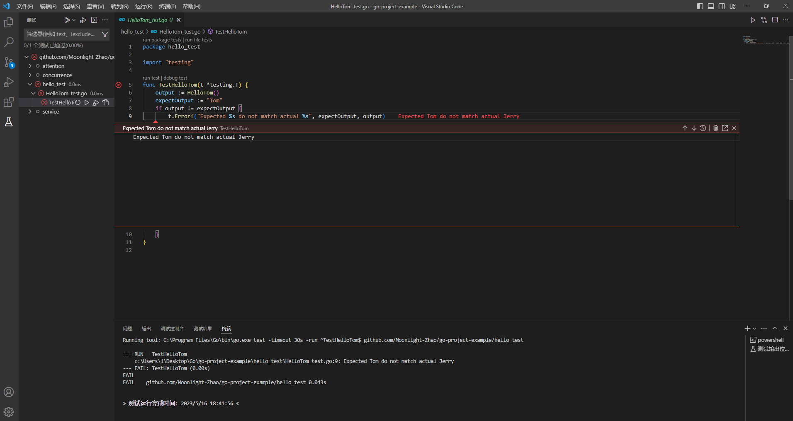

# Go语言工程实践

## Go语言进阶与依赖管理

### 01 语言进阶

#### 并发vs并行

1. 并发：多线程程序在一个核的CPU上运行
2. 并行：多线程程序在多个核的CPU上运行

- Go 可以充分发挥多核优势，高效运行

#### 1.1 Goroutine

- **协程**：用户态，轻量级线程，栈 KB 级别
- **线程**：内核态，线程跑多个协程，栈 MB 级别


- 在Go语言中，为了创建协程，只需要在调用的函数前面**添加 `go` 关键字**即可。

#### 1.2 CSP

- CSP（Communicating Sequential Processes）

  Go 提倡通过通信共享内存而不是通过共享内存而实现通信。

  

#### 1.3 Channel

- 通过 `make(chan 元素类型, [缓冲大小])` 创建

  - 无缓冲通道：`make(chan int)` 
  - 有缓冲通道：`make(chan int, 2)` 

  

#### 1.4 并发安全 Lock

- 为了保证协程并发的安全进行，需要进行加锁操作。

#### 1.5 WaitGroup

- 用 `WaitGroup` 来优雅地实现并发进程的同步。

  `WaitGroup` 包含有一个计数器：

  1. 开启协程，计数器 +1；
  2. 协程执行结束，计数器 -1；
  3. 主协程会阻塞直到计数器为 0（即计数器为 0 表示所有子协程执行完毕）。

### 02 依赖管理

#### 2.1 Go依赖管理演进

- GOPATH -> Go Vendor -> Go Module
  - 不同环境（项目）依赖的版本不同
  - 控制依赖库的版本

##### 2.1.1 GOPATH

- 环境变量 `$GOPATH` ：

  

  GOPATH 问题在于无法实现 package 的多版本控制。

##### 2.1.2 Go Vendor

- 项目目录下增加 vendor 文件，所有依赖包副本形式放在 `$ProjectRoot/vendor` 

  通过每个项目引入一份依赖的副本，解决了多个项目需要同一个 package 依赖的冲突问题。

- 依赖寻址方式：vendor => GOPATH（先 vendor，vendor 没有再 GOPATH）

##### 2.1.3 Go Module

- 通过 `go.mod` 文件管理依赖包版本。通过 `go get/go mod` 指令工具管理依赖包。

#### 2.2 Go Module依赖管理三要素

1. 配置文件，描述依赖：`go.mod`
2. 中心仓库管理依赖库：`Proxy` 
3. 本地工具：`go get/go mod` 

##### 2.2.1 依赖配置-go.mod

```go
module github.com/Moonlight-Zhao/go-project-example		//依赖管理基本单元

go 1.16		//原生库

require (	//单元依赖
	github.com/gin-contrib/sse v0.1.0 // indirect
	github.com/gin-gonic/gin v1.3.0 // indirect
	github.com/go-playground/validator/v10 v10.10.0 // indirect
	github.com/goccy/go-json v0.9.6 // indirect
    ...
)
```

- 单元依赖标识：`[Module Path][Version/Pseudo-version]` 

##### 2.2.2 依赖配置-version

- 语义化版本：`${MAJOR}.${MINOR}.${PATCH}` 
  - 不同的 `MAJOR` 之间的代码是隔离的
  - `MINOR` 用于新增函数等修改
  - `PATCH` 用于补丁，代码bug的修复

##### 2.2.3 依赖配置-indirect

- A->B->C：
  - A->B 直接依赖
  - **A->C 间接依赖（indirect）**

##### 2.2.4 依赖分发-回源

- 如果将依赖包托管在第三方平台上，会有几个问题：
  1. 无法保证构建稳定性：增加/修改/删除软件版本
  2. 无法保证依赖可用性：删除软件
  3. 增加第三方压力：代码托管平台负载问题

##### 2.2.5依赖分发-Proxy

- 为了解决 `2.2.4` 提出的问题，要用到 Proxy。
  - Proxy 会**缓存依赖库**，实现稳定、可靠的分发。
  - 可以将 Proxy 看作是依赖源和开发平台之间的一个“中间商”，该“中间商”会**存储依赖源的各种版本库**，以防在依赖源发生改变后，开发平台无法使用最初依赖的版本库的问题。

## Go语言工程实践之测试

### 03 测试

- 测试是应用发布上线前的最后一步，覆盖率高的测试可以保证上线的应用的可靠性、稳定性和安全性，是避免事故的最后一道屏障。

- 测试主要分为三种：

  - 回归测试：QA人工测试

  - 集成测试：对系统功能进行测试

  - **单元测试**：开发者对单独的模块进行测试。 -> 保证质量、提升效率

    

#### 3.1 单元测试

##### 3.1.1 规则

- 所有测试文件以 `_test.go` 结尾

- 测试函数命名规范为：`func TestXxx(t *testing.T) {}` 

- 初始化逻辑放在 `TestMain` 中：

  ```go
  func TestMain(m *testing.M) {
      //测试前：数据装载、配置初始化等前置工作
      
      code := m.Run()
      
      //测试后：释放资源等收尾工作
      
      os.Exit(code)
  }
  ```

##### 3.1.2 例子

- 接下来以一个返回字符串的函数的测试为例，展示测试函数的使用：

  - 被测试函数：

    ```go
    func HelloTom() string {
        return "Jerry"
    }
    ```

    这个函数的本意是返回 “Tom” 字符串，但是却返回了 “Jerry”。

  - 测试函数：

    ```go
    func TestHelloTom(t *testing.T) {
        output := HelloTom()
        expectOutput := "Tom"
        if output != expectOutput {
            t.Errorf("Expected %s do not match actual %s", expectOutput, output)
        }
    }
    ```

    在测试函数中检测出了问题。

##### 3.1.3 运行

- 在 VScode 中，可以在 `Xxx_test.go` 文件中，通过点击测试函数左侧的执行符号，方便地进行测试，如下图是测试结果：

  

  可以看到，检测出了返回字符串不匹配的问题。

##### ★3.1.4 覆盖率

- 代码覆盖率，是一种通过计算测试过程中 `被执行的源代码` 占 `全部源代码` 的比例，进而间接度量软件质量的方法。它在保证测试质量的时候潜在保证实际产品的质量，可以基于此在程序中寻找没有被测试用例测试过的地方，进一步创建新的测试用例来增加覆盖率。

- 在实际项目中，一般覆盖率在 50%~60% 之间，较高覆盖率能达到 80%+。

  可以通过下面的方法尽可能地提高覆盖率：

  1. 测试分支相互独立，全面覆盖。
  2. 测试单元粒度足够小，函数单一职责。

#### 3.2 单元测试-依赖

- 单元测试要求**幂等&稳定**：
  - **幂等**：重复运行测试一个 case 时，其结果应保持相同。
  - **稳定**：单元测试之间是相互隔离的。

#### 3.3 单元测试-Mock

- Mock 意为 “**模仿的；模拟的**”，是指在测试过程中，对于某些不容易构造或者不容易获取的对象，用一个虚拟的 Mock 对象来创建以便测试的测试方法。

  例如：在单元测试过程中，数据可能需要经过多方获取，且流程复杂：

  

  `Class A `要从 `Class B` 和`Class C`中获取数据，而 `Class C `中该数据又来源于 `Class D `和 `Class E`，这时可以利用 Mock 去构造虚拟的`Class B` 和`Class C`对象用于`Class A `的测试，因为我们只是想测试class A的行为是否符合预期，并不需要去测试依赖对象。

- 常用的 Mock 测试包：[bouk/monkey: Monkey patching in Go (github.com)](https://github.com/bouk/monkey) 

- 快速 Mock 函数：
  - 为一个函数打桩：用打桩函数替代要测试的目标函数，既能对函数的功能进行测试，又不需要对目标函数中所需的文件有强依赖。
  - 为一个方法打桩

#### 3.4 基准测试

- 用于优化代码，对当前代码进行分析。-> 内置的测试框架提供了基准测试的能力。

### 04 项目实践

- 以**掘金社区话题页面**为例，讲述项目开发的流程：

  

#### 4.1 需求描述

1. 展示话题（标题，文字描述）和回帖列表；
2. 暂不考虑前端页面实现，仅仅实现一个本地 web 服务；
3. 话题和回帖数据用文件存储。

#### 4.2 需求用例

- 用 `UML` 来形象直观地表示需求。在这个项目中，`UML` 图展示如下：

  

#### 4.3 ER图

- ER：Entity Relationship，实体关系。

  ER 图表征了现实世界的概念模型及它们之间的关系。在这个项目中，ER 图展示如下：

  

  Topic 和 Post 是一对多的关系。

#### 4.4 分层结构

- 主要采用分层结构来进行项目代码的设计，这样做逻辑清晰，职责明确，通过各层之间暴露的接口来进行合作，而不需要知道其他层的代码实现细节，有利于提高代码编写的效率。

- 分层结构主要分为以下几层：

  

  - **数据层**：数据 Model，外部数据的增删改查；
  - **逻辑层**：业务 Entity，处理核心业务逻辑输出；
  - **视图层**：视图 view，处理和外部的交互逻辑。

#### 4.5 组件工具

- 我们在搭建社区话题页面时，并不需要从零开始一步步搭建，而可以站在巨人的肩膀上，在他人开源的框架的基础之上进行业务开发。

  这是一个开源的 Gin 高性能 go web 框架：[gin-gonic/gin: Gin is a HTTP web framework written in Go (Golang). ](https://github.com/gin-gonic/gin#installation) 

#### 4.6 项目搭建流程

1. 在项目构建之初，我们用 `go mod init` 进行初始化，然后通过 `go get gopkg.in/gin-gonic/gin.v1@v1.3.0` 来远程拉取代码包及其依赖包，并自动完成编译和安装。
2. 根据之前的需求分析对**数据层 Repository** 的数据库部分进行代码编写，应该实现两个基本的查询操作：
   - 根据话题 Id 查询话题：`QueryTopicById` 
   - 根据话题 Id 查询所有帖子数据：`QueryPostByParentId` 

3. 在数据库中查询到数据后，将其传输到**逻辑层 Service** 进行处理：参数校验 `checkParam`  -> 准备数据  `prepareInfo` -> 组装实体 `packPageInfo` ；
4. 然后在**视图层 Controller** 将从逻辑层得到的数据显示为话题页面。
5. 最后，利用 `gin` 这个框架来完成整个项目的实现。包括：
   1. 初始化数据索引；
   2. 初始化引擎配置；
   3. 构建路由；
   4. 启动服务。

- 项目代码可见 [Moonlight-Zhao/go-project-example (github.com)](https://github.com/Moonlight-Zhao/go-project-example) 
