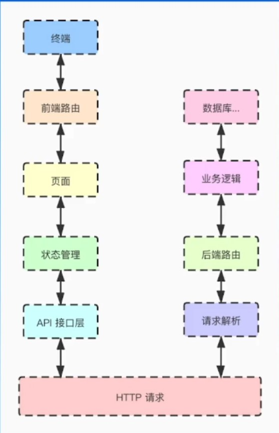
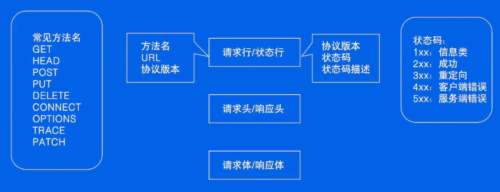
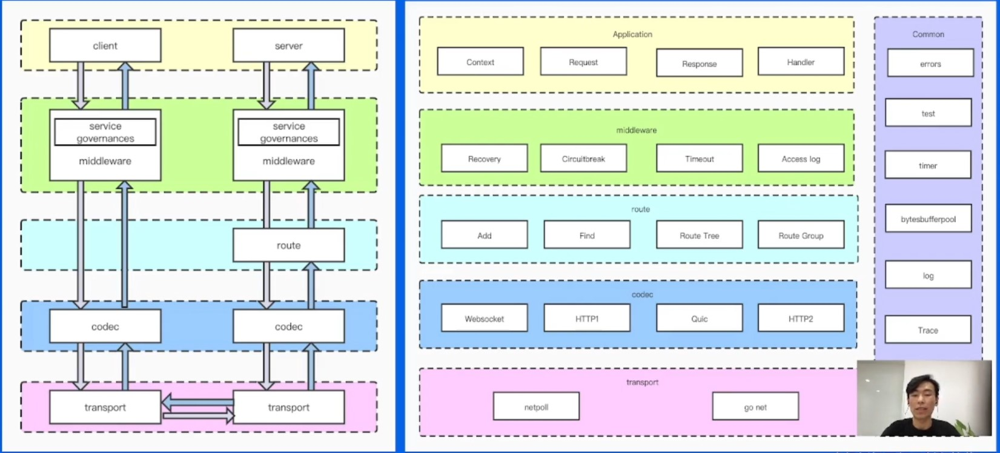
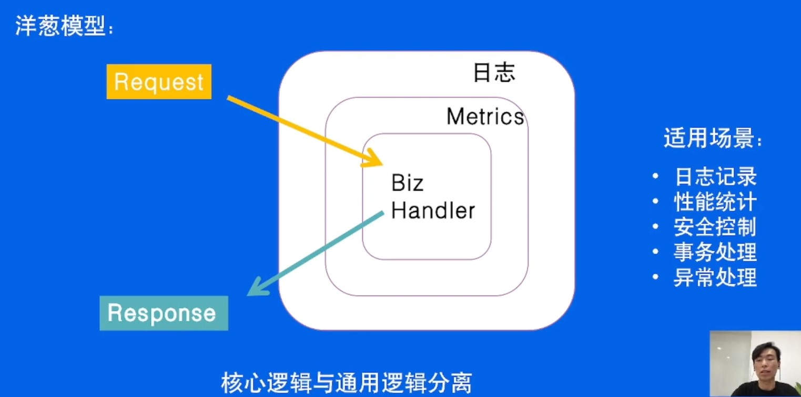

# HTTP框架修炼之道

- `HTTP` 协议是客户端和服务端之间通信的基本协议：

  

## 01 再谈HTTP协议

### 1.1 HTTP协议是什么

- `HTTP`：`HyperText Transfer Protocol`，超文本传输协议。

- 为什么需要协议？

  - 用于让通信双方知道对方想要表达的是什么。

  协议应该有哪些东西？

  - 需要明确的边界：开始、结束。
  - 能够携带什么消息，消息类型是什么。

### 1.2 协议里有什么

- 以 `POST` 请求为例：

  ```http
  POST /sis HTTP/1.1
  Who: Alex
  Content-Type: text/plain
  Host: 127.0.0.1:8888
  Content-Length: 28
  
  Let's watch a movie together
  ```

  - 以上内容分别是：
    - **请求行**：`POST` 请求、被请求人的 `URL`、`HTTP` 协议的版本
    - **元数据**：请求人、请求内容类型、请求人地址、请求内容大小
    - **请求内容**：`Let's watch a movie together` 

  ```http
  HTTP/1.1 200 OK
  Server: hertz
  Date: Thu,21 Apr 2022 11:46:32 GMT
  Content-Type: text/plain;charset=utf-8
  Content-Length: 2
  Upstream-Caught: 1650541592984580
  
  OK
  ```

  - 以上内容分别是：
    - **状态行**：`HTTP` 协议的版本、状态码、状态码描述
    - **元数据**：日期、回复内容类型、回复内容大小
    - **回复内容**：`OK` 

- 所以 `HTTP` 协议里有：**请求行/状态行**、**请求头/响应头**、**请求体/响应体**。

  

## 02 HTTP框架的设计与实现

### 2.1 分层设计

- `HTTP` 框架的设计可以借鉴于计算机网络分层模型的设计，通过将框架分层，来实现**高内聚、低耦合，提高复用性和扩展性**。

  

### 2.2 应用层设计

- 提供合理的 `API` ：
  - **可理解性**：如 `ctx.Body()` 、`ctx.GetBody()` 而不是 `ctx.BodyA()` 。
  - **简单性**：如 `ctx.Request.Header.Peek(key)` 可以直接写为 `ctx.GetHeader(key)` 。
  - **兼容性**
  - **可测试性**
  - **可见性** 

### 2.3 中间件设计

- 中间件需求：

  - 配合 `Handler` 实现一个完整的请求处理生命周期
  - 拥有**预处理逻辑**与**后处理逻辑**
  - 可以注册多中间件
  - 对上层模块用户逻辑模块易用

- **洋葱模型**：

  

### 2.4 路由设计

- 框架路由实际上就是**为 `URL` 匹配对应的处理函数**（`Handlers`）：
  - 静态路由：/a/b/c、/a/b/d
  - 参数路由：/a/:id/c（/a/b/c，/a/d/c）、/*all
  - 路由修复：/a/b <-> /a/b/
  - 冲突路由以及优先级：/a/b、/:id/c
  - 匹配 `HTTP` 方法
  - 多处理函数：方便添加中间件
- **前缀匹配树** 

### 2.5 协议层设计

- 抽象出合适的接口：

  ```go
  type Server interface{
  	Serve(c context.Context, conn network.Conn) error
  }
  ```

### 2.6 网络层设计

- `BIO`：全称是 `Blocking IO`，本身是同步阻塞模式。

  线程发起 IO 请求后，一直阻塞 IO，直到缓冲区数据就绪后，再进入下一步操作，针对网络通信都是一请求一应答的方式。

  `Golang` 标准库中的 `go net` 用的就是 `BIO`。

  ```go
  type Conn interface{
      Read(b []byte)(n int,err error)
      Write(b []byte)(n int,err error)
      ...
  }
  ```

- `NIO`：`Non-Blocking IO`，是同步非阻塞的 IO 模型。

  线程发起 IO 请求后，立即返回（非阻塞 IO）。同步指的是必须等待 IO 缓冲区内的数据就绪，而非阻塞指的是，用户线程不原地等待 IO 缓冲区，可以先做一些其他操作，但是要定时轮询检查IO缓冲区数据是否就绪。

  字节 `cloudwego` 中用的是 `NIO`。

  ```go
  type Reader interface{
      Peek(n int)([]byte,error)
      ...
  }
  
  type Writer interface{
      Malloc(n int)(buf []byte,err error)
  	Flush()error
      ...
  }
  ```

## 03 性能修炼之道

### 3.1 针对网络库的优化

- 前面已经提到：`Golang` 标准库中的 `go net` 用的是 `BIO`。`BIO` 在性能和可靠性方面存在着巨大瓶颈，试想一下如果每个请求都需要新建一个线程来专门处理，那么在高并发的场景下，机器资源很快就会被耗尽。

  所以**在 `BIO` 的基础上，绑定一块缓冲区**，用以存下全部 `Header`，以减少系统调用次数，实现复用内存，多次读。

### 3.2 针对协议的优化

- 主要在 `Headers` 的优化上。
  - 首先找到 `Header Line` 边界：`\r\n`。
  - 然后针对协议相关的 `Headers` 快速解析：
    1. 通过`Header key`首字母快速筛除掉完全不可能的 `key`。
    2. 解析对应 `value` 到独立字段。
    3. 使用 `byte slice` 管理对应 `header` 存储，方便复用。

- **热点资源池化** 