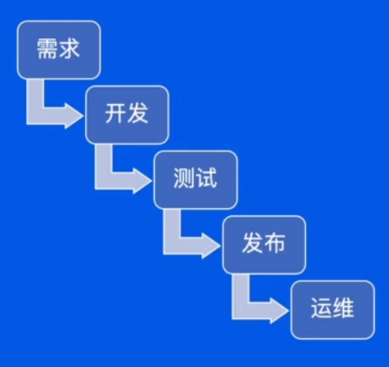
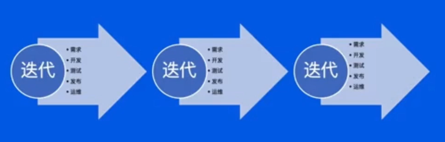
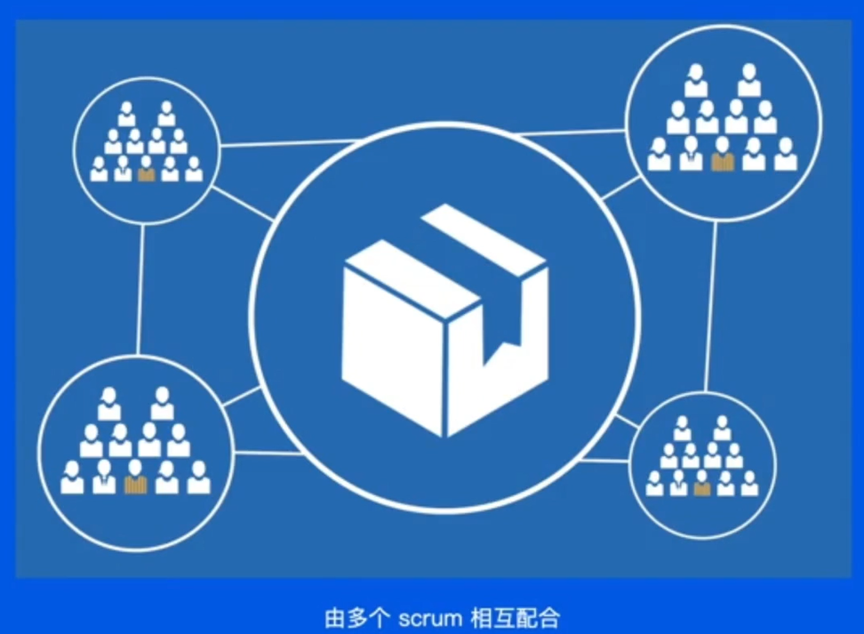

# 从需求到上线全流程

## 走进后端开发流程

### 01 为什么要有流程

#### 1.1 团队规模和流程的关系

- 当一个团队规模越大，项目越复杂，就越需要有科学的流程指导实践。

- 复杂项目没有流程会有什么问题：
  - 需求阶段：每个人都有自己的想法，团队决策需要有一个过程
  - 开发阶段：多人/多端协作开发，每个人有自己的安排，相互配合需要有一个流程
  - 测试阶段：产物怎样交付，测试如何开展，BUG怎么修都需要流程
  - 发布阶段：怎样确保发布过程平稳丝滑，版本和流量如何控制，需要有规范
  - 运维阶段：线上问题如何应急响应，处理用户反馈和线上问题需要有流程

#### 1.2 传统的瀑布模型

- 一个最直观的流程模型。

  - 是工作流程的直观表达；
  - 定义了标准的研发阶段；
  - 以流程为本，是一个理想化模型。

  

#### 1.3 敏捷开发

- 是一个更现代的流程模型。

  - 以小团队快速迭代；
  - 团队成员之间的合作更加紧密；
  - 以人为本，和用户沟通。

  

#### 1.4 The Scaled Agile Framework(SAFe)

- `SAFe` 是一套管理框架。

  - 精益产品开发；
  - 敏捷软件开发；
  - 系统思考。

  

## 开发流程拆解与介绍

### 02 有哪些流程

#### 2.1 需求阶段

- 不要浪费时间讨论不应该存在的问题。
- `MVP`（`Minimum Viable Product`，最小化可行产品）思想：
  - 站在用户的角度思考；
  - 收集用户反馈，快速迭代。

#### 2.2 开发阶段

- **云原生的发展，深刻改变了后端开发的工作。** 

  云原生下的开发：

  - 传统虚拟机：
    - 在物理主机中虚拟出多个虚拟机，每个虚拟机拥有自己的操作系统
    - 运维人员负责维护和交付虚拟机
    - 每个虚拟机中都要安装相应的依赖环境
  - 容器化：
    - 容器是在操作系统中虚拟出来的
    - 通过 `cgroup`，`namespace` 和 `Union Mount` 等技术实现了容器之间的相互隔离，同时容器只有很低的开销
    - 应用和其依赖作为一个整体，打包成镜像交付

  架构的变化：

  - 单体架构：
    - 多个模块共同组成一个服务，服务体量较大
    - 模块之间直接调用，不需要 `RPC` 通信
    - 服务整体扩缩容量
    - 多人开发一个代码仓库，需要充分集成测试
  - 微服务架构：
    - 各个功能在不同的服务中
    - 不同模块需要进行 `RPC` 通信
    - 不同模块可以独立扩缩容
    - 每个服务的代码仓库仅由少部分人维护

- 代码规范：
  - 养成良好的注释习惯，超过三个月的代码，自己都会忘了当时在想什么
  - 不要有魔法数字，魔法字符串
  - 重复的逻辑抽象成公共的方法，不要 `copy` 代码
  - 正确使用 `IDE` 的重构功能，防止修改错误
- 自测：
  - 单元测试
  - 功能环境测试
  - 测试数据构造
- 文档：
  - 大型改造需要有技术设计文档，方案评审
  - 好的接口文档能更方便的和前端进行沟通

#### 2.3 测试阶段

- 功能环境：
  - 需要一个能模拟线上的环境进行开发和测试
  - 环境和环境之间能够隔离，不影响其他功能的开发和测试
- 集成环境：
  - 不同人开发的功能合并在一起测试，相互之间的影响可能产生缺陷
  - 迭代发布的所有功能合并在一起测试，确保发布的所有功能之间的影响不产生缺陷
- 回归环境：
  - 确保新的功能不对老的功能产生影响
  - 回归测试一般会借助自动化测试脚本

#### 2.4 发布阶段

- 发布负责人：
  - 负责按照计划执行发布
  - 需要通知各个相关人员发布进展
  - 观察各个服务的发布状态，及时处理异常
- 变更服务的相关 RD：
  - 按照上线 `checklist` 检查服务的日志，监控，响应上线过程中的告警
  - 对于自己负责的改动，在小流量或者是预览环境进行功能验证
  - 执行发布计划中的其他操作（如线上配置，数据处理等）
- 值班同学：
  - 发布过程中的监控和告警需要特别关注，如果有异常需要立刻判断是否由变更引起
  - 如果有变更引起的告警或者用户反馈，需要及时中止发布

#### 2.5 运维阶段

- 关键动作：
  - 止损：不要一出问题就开始改代码，先止损
  - 周知：通知上下游相关人员
  - 定位：定位问题
  - 修复：修复问题

## 流程优化思路

### 03 流程怎样优化

#### 3.1 DevOps

- `DevOps` （`Development and Operations`）：是一组过程、方法与系统的统称，用于促进开发（应用程序/软件工程）、技术运营和质量保障（QA）部门之间的沟通、协作与整合。
- `DevOps` 解决方案：
  - 代码管理
  - 自动化测试
  - 持续集成 `CI`
  - 持续交付 `CD`

#### 3.2 全流程自动化

- 通过效能平台串联各个阶段：
  - 需求发起研发流程的自动化
  - 写代码，测试环境部署的自动化
  - 自动化测试触发和报告分析
  - 发布过程可观测融入流程

- 减少无价值的等待：
  - 分析整个流程的耗时，计算真正产生价值的时间
  - 不断优化流程，让有价值的流程时间占比上升