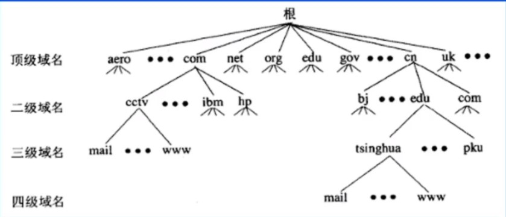
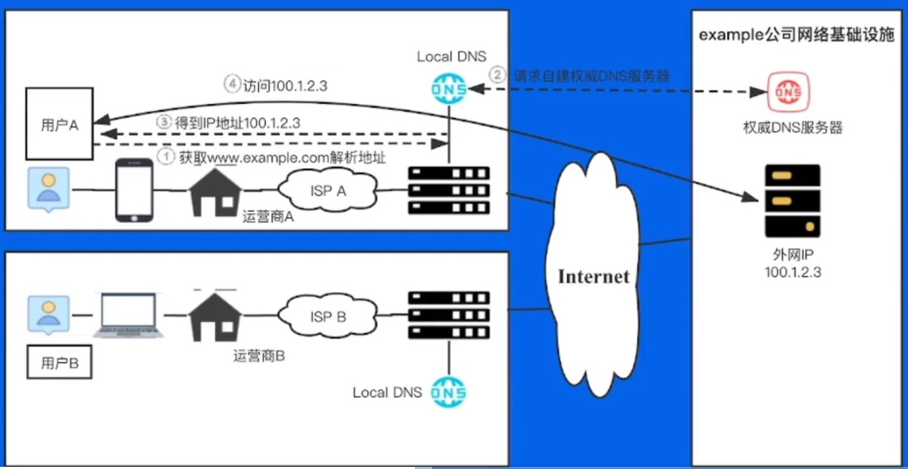
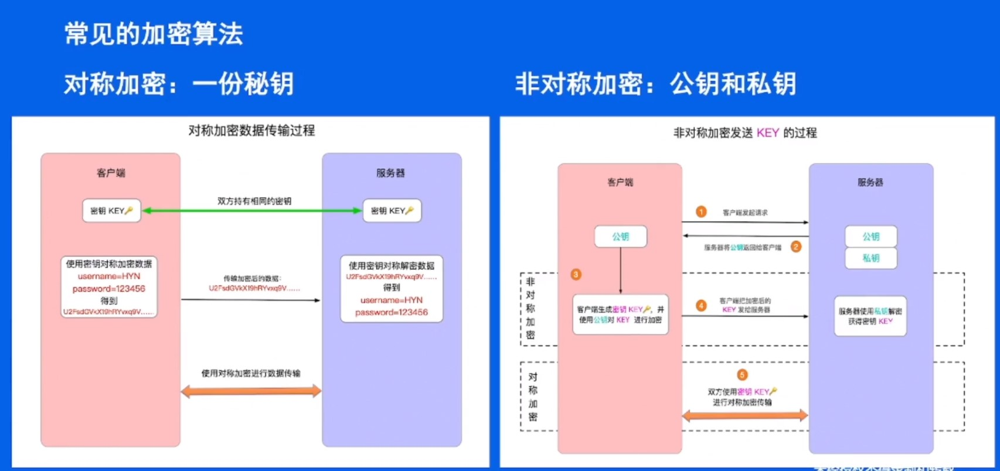
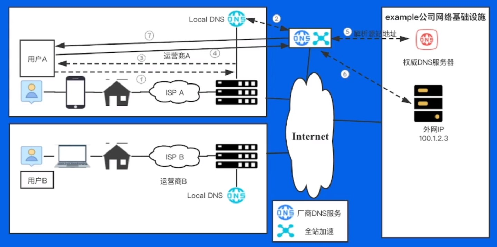

# 将我的服务开放给用户

## 01 接入问题引入

### 1.1 问题引入

- 在浏览器输入 `www.toutiao.com` 到网页加载出来，都经历了哪些过程？
  - `DNS` -> `TCP` -> `TLS` -> `HTTP`请求

### 1.2 字节接入框架


## 02 企业接入升级打怪之路

- 以 “example” 公司为例。

### 2.1 使用域名系统

#### 2.1.1 Host管理

- example 公司建立了自己的主机表 `/etc/hosts` 如下：

  ```
  ##
  # Host Database
  #
  # localhost is used to configure the loopback interface
  # when the system is booting.Do not change this entry.
  ##
  127.0.0.1	1oca1host
  255.255.255.255 broadcasthost
  ::1				localhost
  # example公司主机表
  10.1.2.3 oa.example.com		#办公
  10.2.3.4 wiki.example.com	#文档
  10.3.4.5 passport.example.com	#员工认证
  10.4.5.6 people.example.com		#人事
  ......
  # End of sectton
  ```

- 随着 example 公司业务规模和员工数量的增长，使用`host`表面临诸多问题：
  - 流量和负载：用户规模指数级增长，文件大小越来越大，统一分发引起较大的网络流量和cpu负载。
  - 名称冲突：无法保证主机名称的唯一性，同名主机添加导致服务故障。
  - 时效性：分发靠人工上传，时效性太差。

#### 2.1.2 使用域名系统

- 使用域名系统替换 `hosts` 文件。

- 关于域名空间：

  - 域名空间被组织成树形结构。
  - 域名空间通过划分`zone`的方式进行分层授权管理。
  - 全球公共域名空间仅对应一棵树。
  - 根域名服务器：查询起点。
  - 域名组成格式：`[a-zA-Z0-9_-]`，以点划分`label`。

  

  - 顶级域`gTLD`：`general Top-level Domains`：`.gov`政府 `.edu`教育 `.com`商业 `.mil`军事 `.org`非盈利组织。

- 在有了域名后，就可以修改配置了：

  - 清空 `/etc/hosts`。
  - 配置 `/etc/resolv.conf` 中的 `nameservers` 为公共 DNS 迁移原配置，通过控制台添加解析记录。

#### 2.1.3 如何开放外部用户访问

- 如何建设外部网站，提升公司外部影响力？

  - 方案：租赁一个外网`ip`，专用于外部用户访问门户网站，将 `www.example.com` 解析到外网`ip` 100.1.2.3，将该 `ip` 绑定到一台物理机上，并发布公网 `route`，用于外部用户访问。

  

### 2.2 自建DNS服务器

#### 2.2.1 问题背景

- 内网域名的解析也得出公网去获取，效率低下。
- 外部用户看到内网`ip`地址，容易被`hacker`攻击。
- 云厂商权威`DNS`容易出故障，影响用户体验。
- 持续扩大公司品牌技术影响力，使用自己的`DNS`系统。

#### 2.2.2 DNS查询过程

- 《计算机网络》这门课程对于`DNS`查询过程会有详细的介绍，就不再赘述了。


#### 2.2.3 DNS记录类型

- `A/AAAA`：`IP`指向记录，用于指向`IP`，前者为`IPv4`记录，后者为`IPv6`记录。
- `CNAME`：别名记录，配置值为别名或主机名，客户端根据别名继续解析以提取`IP`地址。
- `TXT`：文本记录，购买证书时需要。
- `MX`：邮件交换记录，用于指向邮件交换服务器。
- `NS`：解析服务器记录，用于指定哪台服务器对于该域名解析。
- `SOA` 记录：起始授权机构记录，每个`zone`有且仅有唯一的一条`SOA`记录，`SOA`是描述`zone`属性以及主要权威服务器的记录。

#### 2.2.4 权威DNS系统架构

- 站在企业角度思考，我们需要的是哪种DNS服务器？
  - 权威`DNS` 
  - `LocalDNS`(可选)

- 常见的开源`DNS`：`bind`、`nsd`、`knot`、`coredns`。

- 权威`DNS`系统架构：

  

  

### 2.3 接入HTTP协议

#### 2.3.1 问题背景

- 在用户访问 `www.example.com` 时，会遇到一些问题：

  - 页面出现白页/出现某些奇怪的东西
  - 返回了403的页面
  - 搜索不了东西
  - 搜索问题带了小尾巴，页面总要闪几次
  - 页面弹窗广告
  - 搜索个汽车就有人给我打电话推销4s店和保险什么的
  - ......

  以上原因在于，`HTTP` 是明文传输，弊端越来越明显。

  - 用 `HTTPS` 来解决：`HTTPS(SECURE HTTP)` 

#### 2.3.2 对称加密和非对称加密

- 《计算机安全与密码学》这门课程对对称加密和非对称加密有详细描述，这里不再赘述。

- 常见的加密算法：

  - **对称加密**：一份密钥
  - **非对称加密**：公钥和私钥

  

#### 2.3.3 SSL的通信过程


### 2.4 接入全站加速

#### 2.4.1 问题背景

- 外网用户访问站点，一定是一帆风顺的吗？可能出现的问题有哪些？

  - 源站容量低，可承载的并发请求数低，容易被打垮。
  - 报文经过的网络设备越多，出问题的概率越大，丢包、劫持、`mtu`问题。
  - 自主选路网络链路长，时延高。

  从用户角度来看，就是响应慢、卡顿。

#### 2.4.2 解决方案

- 源站容量问题：增加后端机器扩容；静态内容，使用静态加速缓存。
- 网络传输问题：动态加速`DCDN`。
- **全站加速：静态加速+动态加速。**

#### 2.4.3 静态加速CDN

- 针对静态文件传输，网络优化方式？
  - **缓存** 
- 通过静态加速 `CDN`，有以下好处：
  - 解决服务器端的“第一公里”问题。
  - 缓解甚至消除了不同运营商之间互联的瓶颈造成的影响。
  - 减轻了各省的出口带宽压力。
  - 优化了网上热点内容的分布。

#### 2.4.4 动态加速DCDN

- **针对`POST`等非静态请求等不能在用户边缘缓存的业务，基于智能选路技术，从众多回源线路中择优选择一条线路进行传输。** 

#### 2.4.5 使用全站加速



### 2.5 四层负载均衡

#### 2.5.1 问题背景

- 提问：在运营商处租用的`100.1.2.3`的公网`IP`，如何在企业内部使用最合理？

  - 现状：直接找一个物理机，`ifconfig`将网卡配上这个`IP`，起`server`监听即可。
  - 应用多，起多个`server`监听不同的端口即可。

  如果这个机器宕机怎么办？

  - 租多个公网 `IP` 。
  - 怎样尽可能充分的利用和管理有限的公网 `IP` 资源？

#### 2.5.2 什么是4层负载均衡

- 基于**`IP`+端口**，利用某种算法将报文转发给某个后端服务器，实现负载均衡地落到后端服务器上。

  

- 三个主要功能：
  - 解耦 `vip(virtual ip)` 和 `rs`。
  - `NAT`。
  - 防攻击：`syn proxy` 。

#### 2.5.3 常见的调度算法原理

- **RR轮询**：`Round Robin`，将所有的请求平均分配给每个真实服务器`RS`。
  - **加权RR轮询**：给每个后端服务器一个权值比例，将请求按照比例分配。
- **最小连接**：把新的连接请求分配到当前连接数最小的服务器。
- **五元组`hash`**：根据`sip`、`sport`、`proto`、`dip`、`dport`对静态分配的服务器做散列取
  模。
  - 缺点：当后端某个服务器故障后，所有连接都重新计算，影响整个`hash`环。
- **一致性`hash`**：只影响故障服务器上的连接`session`,其余服务器上的连接不受影响。

#### 2.5.4 4层负载均衡特点

- 大部分都是通过`dpdk`技术实现，技术成熟，大厂都在用。
- 纯用户态协议栈，`kernel bypass`，消除协议栈瓶颈。
- 无缓存，零拷贝，大页内存（减少`cache miss`)。
- 仅针对4层数据包转发，小包转发可达到限速，可承受高`cps`。

#### 2.5.5 使用4层负载均衡


### 2.6 7层负载均衡

#### 2.6.1 问题背景

- 提问：四层负载对`100.1.2.3`只能`bind`一个`80`端口，而有多个外部站点需要使用，该如何解决？

  换个问法：有一些7层相关的配置需求，该怎么做？

  - `SSL`卸载：业务侧是`http`服务，用户需要用`https`访问。
  - 请求重定向：浏览器访问`toutiao.com`自动跳转`www.toutiao.com`。
  - 路由添加匹配策略：完全、前缀、正则。
  - `Header` 编辑。
  - 跨域支持。
  - 协议支持：`websocket`、`grpc`、`quic`。

#### 2.6.2 Nginx简介

- 最灵活的高性能`WEB SERVER`，应用最广的7层反向代理。
  - **模块化设计**，较好的扩展性和可靠性。
  - 基于`master/worker`架构设计。
  - 支持热部署；可在线升级。
  - 不停机更新配置文件、更换日志文件、更新服务器二进制。
  - 较低的内存消耗：1万个`keep-alve`连接模式下的非活动连接仅消耗`2.5M`内存。
  - 事件驱动：异步非阻塞模型、支持`aio`，`mmap(memory map)`。

#### 2.6.3 Nginx内部架构


#### 2.6.4 使用7层负载均衡

