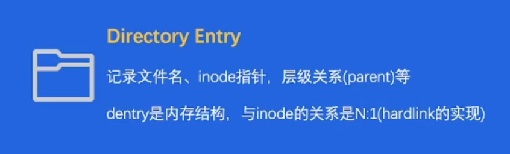

# 带你认识存储&数据库

## 认识存储与数据库

### 01 经典案例

- 一条数据从产生，到数据流动，最后持久化的全生命周期。

#### 1.1 数据的流动

- 以用户注册为例：用户在应用上进行注册后，一条用户注册数据就会被传输到应用的后端服务器。但是如果仅仅将用户注册的信息保存在服务器的内存中，不仅会占用服务器的内存，还有可能造成数据丢失。因此，服务器还要将用户的数据传输到数据库进行保存，以实现数据存储的持久化。

  

#### 1.2 数据的持久化

- 数据库在进行数据的持久化时，会进行以下一些操作：
  - 校验数据的合法性：判断数据是否合法，例如数据是否重复
  - 修改内存：用高效的数据结构组织数据
  - 写入存储介质：以寿命 & 性能友好的方式写入硬件，在对数据进行存储时，还应该考虑硬件的友好性，毕竟最后数据是存储在硬件中的

### 02 存储&数据库简介

#### 2.1 存储系统

##### 2.1.1 系统概览

- 什么是存储系统？

  ​	-> 一个**提供**了读写、控制类**接口**，能够安全有效地**把数据持久化**的软件，就可以称为存储系统。

##### 2.1.2 系统特点

- 作为后端软件的底座，性能敏感。
- 存储系统代码，既“简单”又“复杂”：
  - “简单” 在于存储系统要求高性能，所以存储系统在 I/O 路径上的代码不能写的很复杂，不能有很多分支。
  - “复杂” 在于在非 I/O 路径上、在错误处理路径上，要考虑周全出错的情况，所以代码会写得比较复杂。
- 存储系统软件架构，容易受硬件影响。

##### 2.1.3 存储器层级结构

- 存储器的层级结构即为《计算机组成原理》课程中有关存储器的层级结构，如下图所示：

  

##### 2.1.4 RAID技术

- RAID：`Redundant Array of Inexpensive Disks`，磁盘阵列。
  - RAID 0：多块磁盘简单组合；数据条带化存储，提高磁盘带宽；没有额外的容错设计。
  - RAID 1：目的在于提高容错，一块磁盘对应一块额外镜像盘，真实空间利用率仅为 50%（剩下 50% 用于备份），容错能力强。
  - RAID 0+1：结合了 RAID 0 和RAID 1，真实空间利用率仅 50%，容错能力强，写入带宽好。

#### 2.2 数据库

- 虽然存储系统和数据库的最终目的都是用于存储数据，但是它们不是同一个东西。
- 数据库分为**关系型数据库**和**非关系型数据库**。

##### 2.2.1 概览

- 关系 = 集合 = 任意元素组成的若干有序偶对，反映了事物间的关系。

  关系代数 = 对关系作运算的抽象查询语言：交、并、笛卡尔积。

##### 2.2.2 关系型数据库特点

- 关系型数据库是存储系统，但是在存储之外，又发展出其他能力：
  - **结构化数据友好**
  - **支持事务** ACID
  - **支持复杂查询语言**，如 `SQL` 

##### 2.2.3 非关系型数据库特点

- 非关系型数据库也是存储系统，但是**一般不要求严格的结构化**：
  - **半结构化数据友好**
  - 可能支持事务 ACID
  - 可能支持复杂查询语言，如 `SQL` 

#### 2.3 数据库 vs 经典存储

##### 2.3.1 结构化数据管理

- 以用户的注册数据为例：

  - 对关系型数据库来说，用户的注册数据会以**表形式**管理。
  - 对经典存储来说，我们就要写入文件，**自行定义管理结构**，较为复杂。

  

##### 2.3.2 事务能力

- 关系型数据库支持事务 ACID：
  - **A**tomicity，事务内的操作要么全做，要么不做；
  - **C**onsistency，事务执行前后，数据状态是一致的；
  - **l**solation，可以隔离多个并发事务，避免影响；
  - **D**urability，事务一旦提交成功，数据保证持久性。

##### 2.3.3 复杂查询能力

- 相比于经典存储，关系型数据库可以用 `SQL` 方便快捷地进行复杂查询，而经典存储可能还要进行一系列的分支、循环等操作才能完成查询要求。

  例如：请查询出名字以 xiao 开头，且密码提示问题小于10个字的人，并按性别分组统计人数。

  - 用 SQL 语句进行查询时，用 `Select gender, count(*) from user where user_name like 'xiao%' and len(password_hint) < 10 group by gender;` 即可；

  - 而用经典存储时，则需要复杂的代码操作：

    ```
    for each data { 
        if (user_name... && password_hint...) {
            mark in list 
        } 
    } 
    for each in marked_list {
        if (gender == ...){
            ...
        } 
    } 
    ```

## 主流存储产品剖析

### 03 主流产品剖析

#### 3.1 单机存储

- 单机存储 = 单个计算机节点上的存储软件系统，一般不涉及网络交互。

##### 3.1.1 本地文件系统

- 文件系统的管理单元 : 文件。

- 文件系统接口 : 文件系统繁多，如 `Ext2/3/4`、`sysfs`、 `rootfs` 等，但都遵循 `VFS` 的统一抽象接口。

  - 背后逻辑在于：虽然有各种各样的硬件，但是为了上层应用使用的方便，这些硬件都应该有统一的接口规则，这样上层应用就不需要关心不同硬件的使用细节，而只需要会使用统一的接口即可。

- `Linux` 文件系统的两大数据结构 : `Index Node` & `Directory Entry` 

  

  

##### 3.1.2 key-value存储

- 所谓的 `Key-Value` 就是每次存储一个数据时，是根据 `Key` 进行索引存储的，`Value` 是对应该 `Key` 的值。
- 常见使用方式：`put(k, v)` 、`get(k)` 
- 常见数据结构：`LSM-Tree`，某种程度上牺牲读性能，追求写入性能。

#### 3.2 分布式存储

- 分布式存储 = 在单机存储基础上实现了分布式协议，涉及大量网络交互。

##### 3.2.1 分布式文件系统HDFS

- `HDFS`核心特点：
  - 支持**海量数据存储** 
  - **高容错性** 
  - 弱 POSIX 语义
  - 使用普通 x86 服务器，**性价比高** 

##### 3.2.2 Ceph

- `Ceph` 核心特点：
  - 一套系统支持对象接口、块接口、文件接口，但是**一切皆对象**
  - 数据写入采用**主备复制模型**
  - 数据分布模型采用 **CRUSH** 算法

#### 3.3 单机关系型数据库

- 单机数据库 = 单个计算机节点上的数据库系统
- 事务在单机内执行，也可能通过网络交互实现分布式事务
- 在关系型数据库中，常见产品有 `Oracle`、`MySQL`、`PostgreSQL`，其中 `Oracle` 是商用的，后两者是开源的。

##### 3.3.1 关系型数据库的通用组件

- Query Engine：负责解析 query，生成查询计划
- Txn Manager：负责事务并发管理
- Lock Manager：负责锁相关的策略
- Storage Engine：负责组织内存/磁盘数据结构
- Replication：负责主备同步

##### 3.3.2 关系型数据库结构解析

- 如图所示，在关系型数据库中，内存部分的数据是以树的形式来组织的，每一个节点都代表一页Page；除了树之外，还有大量的 `Temp data`，用于存储临时的数据。

  在硬盘中，有三类文件：

  - `Page Files`：对应于内存树中的Page；
  - `Redo Log Files`：记录了事务执行过程中的 `Redo Log`；
  - `Others`：可以用来存储临时数据文件。

  

#### 3.4 单机非关系型数据库

- 在非关系型数据库中，常见产品有 `MongoDB`、`Redis`、`Elasticsearch`。

- 关系型数据库一般直接使用 SQL 交互，而**非关系型数据库交互方式各不相同**。
- 非关系型数据库的数据结构千奇百怪，没有关系约束后，schema相对灵活。
- 不管是否关系型数据库，大家都在尝试支持 SQL(子集)和 “事务”。

##### 3.4.1 Elasticsearch

- 面向「文档」存储
- 文档可序列化成 `JSON`，支持嵌套
- 存在「index」，index = 文档的集合
- 存储和构建索引能力依赖 Lucene 引攀
- 实现了大量搜索数据结构 & 算法
- 支持 `RESTFUL API`，也支持弱 `SQL` 交互

##### 3.4.2 MongoDB

- 面向「文档」存储
- 文档可序列化成 `JSON/BSON`，支持嵌套
- 存在「collection」，collection = 文档的集合
- 存储和构建索引能力依赖 wiredTiger 引擎
- 4.0 后开始支持事务（多文档、跨分片多文档等）
- 常用 `client/SDK` 交互，可通过插件转译支持弱 `SQL` 

##### 3.4.3 Redis

- 数据结构丰富（hash表、set、Zset、Iist）
- C语言实现，超高性能
- 主要基于内存，但支持 AOF/RDB 特久化
- 常用 `redis-di`/多语言 SDK 交互

#### 3.5 分布式数据库

- 鉴于单机数据库遇到的如下问题：

  - 容量：单点容量有限，受硬件限制；
  - 弹性：用户的需求在弹性变化；
  - 性价比：单机的硬件参数是固定的，可能会有资源浪费；

  我们开始采用分布式数据库（**池化技术**）。