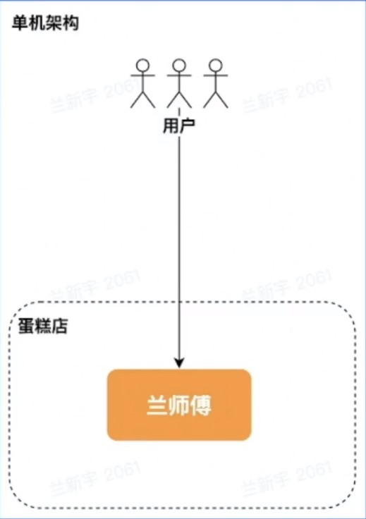
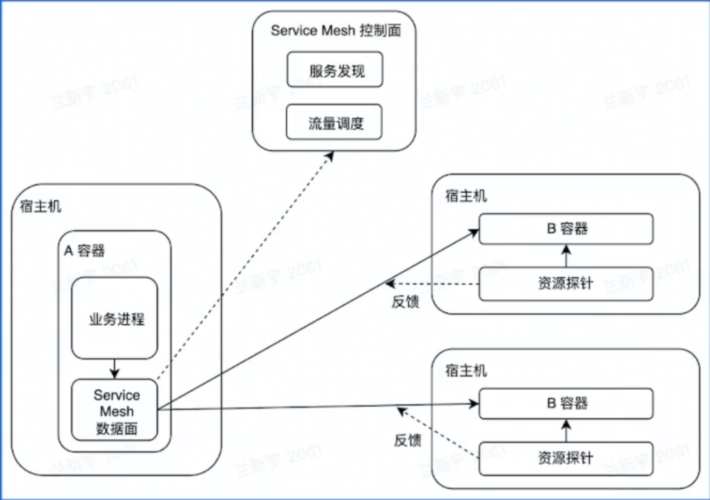

# 架构初探之谁动了我的蛋糕

## 01 什么是架构

- 架构，又称软件架构，是有关**软件整体结构与组件**的抽象描述，用于**指导软件系统各个方面的设计**。

### 1.1 单机

- 软件系统需要具备对外提供服务，**单机**，就是把所有功能都实现在一个进程里，并部署在一台机器上。
  - 优点：简单。
  - 问题：
    - `C10K problem`：所谓`c10k`问题，指的是：服务器如何支持 `10k` 个并发连接，也就是`concurrent 10000 connection`（这也是 `c10k` 这个名字的由来）。由于硬件成本的大幅度降低和硬件技术的进步，如果一台服务器能够同时服务更多的客户端，那么也就意味着服务每一个客户端的成本大幅度降低。从这个角度来看，`c10k`问题显得非常有意义。
    - 运维需要停服。

### 1.2 单体、垂直应用|垂直切分

- 单体架构：**分布式部署**。

  垂直应用架构：**按应用垂直切分的单体**。

  - 优点：
    - 水平扩容。
    - 运维不需要停服。
  - 问题：
    - 职责太多，开发效率不高。
    - 爆炸半径大。

### 1.3 SOA、微服务|水平切分

- **`SOA(Service-Oriented-Architecture)`**：

  1. 将应用的不同功能单元抽象为**服务**。
  2. 定义服务之间的**通信标准**。

  **微服务架构：SOA**的去中心化演进方向。

  - 问题：
    - **数据一致性**。
    - 高可用。
    - 治理。
    - **解耦vs过微**。

## 02 企业级后端架构剖析

### 2.1 云计算

- 云计算：是指**通过软件自动化管理，提供计算资源的服务网络**，是现代互联网大规模熟悉分析和存储的基石。

  基础：

  - **虚拟化技术**。
  - **编排方案**。

- 架构：

  - `IaaS：Infrastructure as a Service`，基础设施即服务。
  - `PaaS：Platform as a Service`，平台即服务。
  - `SaaS：Software as a Service`，软件即服务。
  - `FaaS：Function as a Service`，功能即服务。

### 2.2 云原生

- 云原生技术为组织（公司）在公有云、自由云、混合云等新型的动态环境中，构建和运行可弹性拓展的应用提供了可能。

  

#### 2.2.1 云原生之弹性计算资源

- 弹性**计算资源**类型：
  - 服务资源调度
    - 微服务：和面、雕花
    - 大服务：烤箱
  - 计算资源调度
    - 在线：热销榜单
    - 离线：热销榜单更新
  - 消息队列
    - 在线：削峰、解耦
    - 离线：大数据分析

#### 2.2.2 云原生之弹性存储资源

- 弹性**存储资源**类型：
  - 经典
    - 对象：宣传视频
    - 大数据：用户消费记录
  - 关系型数据库
    - 收银记录
  - 元数据
    - 服务发现：蛋糕店通讯录
  - `NoSQL`
    - `KV`：来个 xx 蛋糕

#### 2.2.3 云原生之DevOps

- `Dev0ps`是云原生时代软件交付的利器，贯穿整个软件开发周期。
- 结合自动化流程，提高软件开发、交付效率。

#### 2.2.4 云原生之微服务架构

- **通信标准**：
  - `HTTP(RESTful API)` 
  - `RPC(Thrift, gRPC)` 
- 微服务中间件 `RPC` vs `HTTP` 
  - 性能
  - 服务治理
  - 协议可解释性
- 云原生场景下，微服务大可不必在业务逻辑中实现符合通信标准的交互逻辑，而是交给框架来做。

#### 2.2.5 云原生之服务网格

- 服务网格(`Service Mesh`)：
  - 微服务之间通讯的中间层
  - 高性能网络代理
  - 业务代码与治理解耦

- 相比较于 `RPC/HTTP`框架：
  - 异构系统治理统一化
  - 与业务进程解耦，生命周期易管理

## 03 企业级后端架构的挑战

- 挑战：
  - **基础设施层面**：
    - 物理资源是有限的：机器、带宽。
    - 资源利用率受制于部署服务。
  - **用户层面**：
    - 网络通信开销较大。
    - 网络抖动导致运维成本提高。
    - 异构环境下，不同实例资源水位不均。

### 3.1 离在线资源并池

- 核心诉求：

  - 降低物理资源成本，提供更多的弹性资源，增加收入

- 解决思路：**离在线资源并池** 

  

  - 在线业务特点：
    - I/O 密集型为主
    - 潮汐性、实时性
  - 离线业务特点：
    - 计算密集型占多数
    - 非实时性

### 3.2 自动扩缩容

- 核心诉求：降低业务成本

- 解决思路：**自动扩缩容**

  - 利用在线业务潮汐性自动扩缩容

  

### 3.3 微服务亲和性部署

- 核心诉求

  - 降低业务成本
  - 提高服务可用性

- 解决思路：**微服务亲和性部署**

  - **将满足亲合性条件的容器调度到一台宿主机**
  - 微服务中间件与服务网格通过共享内存通信
  - 服务网格控制面实施灵活、动态的流量调度

  

### 3.4 流量治理

- 核心诉求：
  - 提高微服务调用容错性
  - 容灾
  - 进一步提高开发效率，`DevOps` 发挥到极致
- 解决思路：**基于微服务中间件&服务网格的流量治理**
  - 熔断、重试
  - 单元化
  - 复杂环境的流量调度

### 3.5 CPU水位负载均衡

- 核心诉求：

  - 打平异构环境算力差异
  - 为自动扩缩容提供正向输入

- 解决思路：**CPU水位负载均衡**

  - `laaS`：提供资源探针
  - 服务网格：动态负载均衡

  

## 04 后端架构实战

- 该实战为 3.5 节 - “CPU水位负载均衡”的实现。

- 输入：
  - 服务网格数据面
    - 支持带权重的负载均衡策略
  - 注册中心存储了所有容器的权重信息
  - 宿主机能提供
    - 容器的资源使用情况
    - 物理资源信息（如CPU型号）
- 关键点：
  - 紧急回滚能力
  - 大规模
  - 极端场景

### 4.1 自适应静态权重

- 方案：
  - 采集宿主机物理资源信息
  - 调整容器注册的权重
- 优势：
  - 复杂度低
  - 完全分布式，可用性高
  - 微服务中间件无适配成本
- 缺点：
  - 无紧急回滚能力
  - 缺乏运行时自适应能力

### 4.2 自适应动态权重Alpha

- 方案：
  - 容器动态权重的自适应调整
  - 服务网格的服务发现&流量调度能力
- 演进方向：
  - 解决无法紧急回滚的问题
  - 运行时权重自适应
- 缺点：过度流量倾斜可能会有异常情况

### 4.3 自适应动态权重Beta

- 方案：服务网格上报 RPC 指标
- 演进方向：极端场景的处理成为可能
- 缺点：
  - 时序数据库压力较大
  - 动态权重决策中心职责越来越多，迭代 -> 变更 -> 风险

### 4.4 自适应动态权重Release

- 演进方向：
  - 微服务化
  - 引入消息队列削峰，解耦
  - 离在线链路切分
  - 梳理强弱依赖

