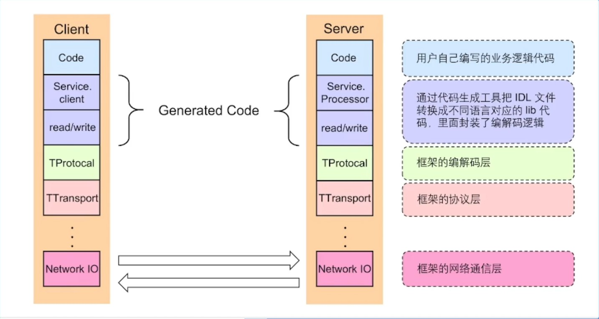

# 深入浅出RPC

## 01 基本概念

- `RPC：Remote Procedure Calls`，远程函数调用。

  假设有两台服务器 A，B，一个应用部署在 A 服务器上，想要调用 B 服务器上应用提供的函数/方法，由于不在一个内存空间，不能直接调用，需要通过网络来表达调用的语义和传达调用的数据。

  - `RPC` 需要解决的问题：
    1. 函数映射。
    2. 数据转换成字节流。
    3. 网络传输。

### 1.1 一次RPC的完整过程

- `IDL(Interface description language)`文件：`IDL`通过一种中立的方式来描述接口，使得在不同平台上运行的对象和用不同语言编写的程序可以相互通信。
- 生成代码`GenCode`：通过编译器工具把`IDL`文件转换成语言对应的静态库。
- 编解码`Encoder/Decoder`：从“内存中表示”到“字节序列”的转换称为编码，反之为解码，也常叫做序列化和反序列化。
- 通信协议`Protocol`：规范了数据在网络中的传输内容和格式。除必须的请求/响应数据外，通常还会包含额外的元数据。
- 网络传输`Transfer`：通常基于成熟的网络库走`TCP/UDP`传输。

### 1.2 RPC的好处

1. 单一职责，有利于分工协作和运维开发。
2. 可扩展性强，资源使用率更优。
3. 故障隔离，服务的整体可靠性更高。

### 1.3 RPC带来的问题

1. 服务宕机，对方应该如何处理？
2. 在调用过程中发生网络异常，如何保证消息的可达性？
3. 请求量突增导致服务无法及时处理，有哪些应对措施？

- 以上问题，我们需要用 `RPC` 框架来解决。

## 02 分层设计

- 我们以 `Apache Thrift` 为例进行介绍。

  `Apache Thrift` 是一款基于 C/S 架构的 `RPC` 框架，最初由 Facebook 研发，2008 年转入 Apache 组织。

  

- `RPC`框架的主要核心有三层：编解码层、协议层和网络通信层。

### 2.1 编解码层-生成代码

- `Client` 和 `Server` 依赖同一份 `IDL` 文件，根据该文件可以生成不同语言的代码 `GenCode`。

  

### 2.2 编解码层-数据格式

- **语言特定的格式**：许多编程语言都内建了将内存对象编码为字节序列的支持，例如 `Java`  `java.io.Serializable`。
- **文本格式**：`JSON`、`XML`、`CSV`等文本格式，具有人类可读性。
- **二进制编码**：具备跨语言和高性能等优点，常见有 `Thrift` 的 `BinaryProtocol`，`Protobuf` 等。

### 2.3 编解码层-二进制编码

- 以 `Thrift` 的 `BinaryProtocol` 中的 `TLV` 编码为例：

  - `Tag`：标签，可以理解为类型。
  - `Length`：长度。
  - `Value`：值，`Value` 也可以是个 `TLV` 结构。

  

  

### 2.4 编解码层-编码语言选型

- **兼容性**：支持自动增加新的字段，而不影响老的服务，这将提高系统的灵活度
- **通用性**：支持跨平台、跨语言
- **性能**：从空间和时间两个维度来考虑，也就是编码后数据大小和编码耗费时长

### 2.5 协议层-协议构造

- `LENGTH`：数据包大小，不包含自身。
- `HEADER MAGIC`：标识版本信息，协议解析时候快速校验。
- `SEQUENCE NUMBER`：表示数据包的 `seqID`，可用于多路复用，单连接内递增。
- `HEADER SIZE`：头部长度，从第14个字节开始计算一直到 `PAYLOAD` 前。
- `PROTOCOL ID`：编解码方式，有 `Binary` 和 `Compact` 两种。
- `TRANSFORM ID`：压缩方式，如 `zlib` 和 `snappy`。
- `INFO ID`：传递一些定制的 `meta` 信息。
- `PAYLOAD`：消息体。

### 2.6 网络通信层-Sockets API

## 03 关键指标

### 3.1 稳定性

- 保障策略：

  - **熔断**：**保护调用方**，防止被调用的服务出现问题而影响到整个链路。

  - **限流**：**保护被调用方**，防止大流量把服务压垮。

  - **超时控制**：避免浪费资源在不可用节点上。

- **提高请求成功率**：负载均衡、重试。

- **长尾请求**：长尾请求一般是指明显高于均值的那部分占比较小的请求。 业界关于延迟有一个常用的 `P99` 标准， 也就是99%的请求延迟要满足在一定耗时以内， 1%的请求会大于这个耗时， 而这1%就可以认为是长尾请求。

  - 解决方法：`Backup Request`，备份请求。

- **注册中间件**：`RPC` 框架通过中间件来注入各种服务治理策略，保障服务的稳定性。

### 3.2 易用性

- **开箱即用**：合理的默认参数选项、丰富的文档。
- **周边工具**：生成代码工具、脚手架工具。
- **简单易用的命令行工具**：
  - 生成服务代码脚手架
  - 支持`protobuf`和`thrift`
  - 内置功能丰富的选项
  - 支持自定义的生成代码插件

### 3.3 扩展性

- 扩展点：
  - `Middleware`
  - `Option`
  - 编解码层
  - 协议层
  - 网络传输层
  - 代码生成工具插件扩展

### 3.4 观测性

- 能通过一些手段来观察框架运行过程中的性能：`Log`、`Metric`、`Tracing`，内置观测性服务。

### 3.5 高性能-高吞吐、低延迟

- **场景**：
  - 单机多机。
  - 单连接多连接。
  - 单/多 client、单/多 server。
  - 不同大小的请求包。
  - 不同请求类型，例如 `pingpong`、`streaming`。
- **手段**：
  - 连接池。
  - 多路复用。
  - 高性能编解码协议。
  - 高性能网络库。

## 04 企业实践

- 介绍一下字节跳动内部使用的 `RPC` 框架 - `Kitex`。

### 4.1 整体架构-Kitex

- `Kitex Core`：核心组件。
- `Kitex Byted`：与公司内部基础设施集成。
- `Kitex Tool`：代码生成工具。

### 4.2 自研网络库-netpoll

- **背景**：
  - 原生库无法感知连接状态：在使用连接池时，池中存在失效连接，影响连接池的复用。
  - 原生库存在`goroutine`暴涨的风险：一个连接一个`goroutine`的模式，由于连接利用率低下，存在大量`goroutine`占用调度开销，影响性能。

- **自研网络库 - `netpoll`**：
  - 解决无法感知连接状态问题：引入`epoll`主动监听机制，感知连接状态
  - 解决`goroutine`暴涨的风险：建立`goroutine`池，复用`goroutine`
  - 提升性能：引入`Nocopy Buffer`，向上层提供`NoCopy`的调用接口，编解码层面零拷贝

### 4.3 扩展性设计

- 支持多协议，也支持灵活的自定义协议扩展。

  |        **Interaction**         | Ping-Pong / Streaming / Oneway |
  | :----------------------------: | :----------------------------: |
  |           **Codec**            |       Thrift / Protobuf        |
  | **Application Layer Protocol** |      TTHeader / HTTP2 / -      |
  |      **Transport Layer**       |        TCP / UDP / RDMA        |

### 4.4 性能优化

- **网络库优化**：
  - 调度优化：
    - `epoll_wait`在调度上的控制。
    - `gopool`重用`goroutine`降低同时运行协程数。
  - `LinkBuffer` ：
    - 读写并行无锁，支持`nocopy`地流式读写。
    - 高效扩缩容。
    - `Nocopy Buffer`池化，减少`GC`。
  - `Pool` ：
    - 引入内存池和对象池，减少`GC`开销。

- **编解码优化**：
  - `Codegen`：
    - 预计算并预分配内存，减少内存操作次数，包括内存分配和拷贝。
    - `Inline`减少函数调用次数和避免不必要的反射操作等。
    - 自研了`Go`语言实现的`Thrift IDL`解析和代码生成器，支持完善的`Thrift IDL`语法和语义检查，并支持了插件机制 - `Thriftgo`。
  - `JIT：Just In Time` 
    - 使用`JIT`编译技术改善用户体验的同时带来更强的编解码性能，减轻用户维护生成代码的负担。
    - 基于`JIT`编译技术的高性能动态`Thrift`编解码器 - `Frugal`。

### 4.5 合并部署

- 微服务的不足之处：微服务过微，传输和序列化的开销越来越大。
  - 为此将亲和性强的服务实例尽可能调度到同一个物理机，远程`RPC`调用优化为本地`IPC`调用。
- **中心化的部署调度和流量控制**
- **基于共享内存的通信协议**
- **定制化的服务发现和连接池实现**
- **定制化的服务启动和监听逻辑**