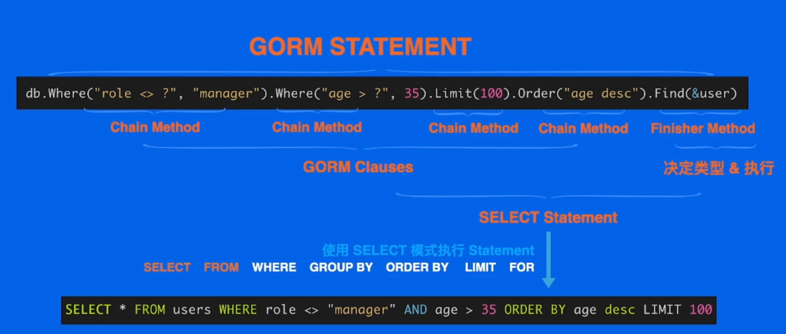
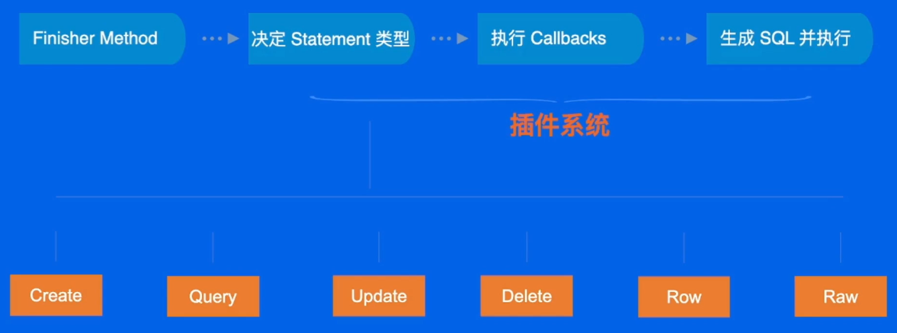

# 设计模式之Database/SQL与GORM

## Database/sql 及 GORM 相关解读

### 01 理解 database/sql

- `database/sql` 是 Go 语言中的一个**标准库**，用于处理关系型数据库的操作。`database/sql` 库的目标在于可以让用户用统一的接口去操作不同的数据库。

  可以理解为：上层应用在查询数据时，并不是直接与数据库进行交互，而是通过 Go 的 `database/sql` 标准库，去从数据库中查询数据、得到数据，即真正与数据库**直接**打交道的，是 `database/sql` 这个“中间层”。

#### 1.1 设计原理

- `database/sql` 对上层应用程序提供了标准的 `api` 操作接口；

  对下层数据库暴露一些简单的驱动（`Driver`）接口；

  在内部实现了连接池（**池化技术**）的管理。

  

### 02 GORM 简介

- `GORM` 是设计简洁、功能强大、自由扩展的全功能 `ORM`。

  - `ORM`：即 `Object-Relational Mapping`，它的作用是**在关系型数据库和对象之间作一个映射**，这样，我们在具体的操作数据库的时候，就不需要再去和复杂的SQL语句打交道，只要像平时操作对象一样操作它就可以了。

- `GORM` 设计原则：API 精简、测试优先、最小惊讶、灵活扩展、无依赖 可信赖

  功能完善：

  - 关联 : 一对一、一对多、单表自关联、多态；Preload、Joins 预加载、级联删除；关联模式；自定义关联表
  - 事务 : 事务代码块、嵌套事务、Save Point
  - 多数据库、读写分离、命名参数、Map、子查询、分组条件、代码共享、SQL表达式(查询、创建、更新)、自动选字段、查询优化器
  - 字段权限、软删除、批量数据处理、Prepared Stmt、自定义类型、命名策略、虚拟字段、自动 track 时间、SQL Builder、Logger
  - 代码生成、复合主键、Constraint、Prometheus、Auto Migration、真·跨数据库兼容...
  - 多模式灵活自由扩展

### 03 GORM 设计原理

- `GORM` 处于上层应用程序和 `database/sql` 标准库之间。

  

#### 3.1 GORM 中 SQL 是怎么生成的

1. 首先解析 `SQL` 语句：

   ```sql
   SELECT `name`, `age`, `employee_number`		-- SELECT Clause 
   FROM `users` 								-- FROM Clause 
   WHERE role <> "manager" AND age > 35 		-- WHERE Clause 
   ORDER BY age DESC 							-- ORDER BY Clause 
   LIMIT 10 OFFSET 10 							-- LIMIT Clause 
   FOR UPDATE									-- FOR Clause  
   ```

   可以看到 `SQL` 语句**由许多子句**构成，其中有些子句是必须的（如 `SELECT Clause`、`FROM Clause`），有些是不强制要求的（如 `WHERE Clause`、`ORDER BY Clause`）

2. 再来解析 `GORM` 语句：

   ```go
   db.Where("role ?", "manager"). Where("age > ?", 35). Limit(100). Order("age desc"). Find(&user)
   ```

   `GORM` 语句由 `Chain Method` 和 `Finisher Method` 组成

   - `Chain Method` 即为为 `GORM` 语句添加 `GORM Clause` 的方法。
   - `Finisher Method` 决定了 `SQL` 语句的执行类型。

3. 我们的目标就是能**从 `GORM` 语句得到 `SQL` 语句**。如下图所示：

   

   至于实现的代码，可以见 `GORM` 源代码。

#### 3.2 插件是怎么工作的

- 3.1 节已经说过，`Finisher Method` 决定了 `SQL` 语句的执行类型，而在 `GORM` 生成 `SQL` 并执行之前，会执行 `Callbacks` 函数，即使用到了插件。

  如下图，`GORM` 对每一组类型，都有一组 `Callbacks` 函数调用，即使用到了插件。

  

- 以 `Create` 类型为例，`GORM` 预定义了一组 `Callbacks`：

  ```go
  db.Callback().Create(). Register("gorm : begin_transaction", BeginTransaction)
  db.Callback().Create(). Register("gorm : before_create", BeforeCreate)
  db.Callback().Create(). Register("gorm : save_before_associations", SaveBeforeAssociations) db.Callback().Create(). Register("gorm : create", Create) 
  db.Callback().Create(). Register("gorm : save_after_associations", SaveAfterAssociations) 
  db.Callback().Create(). Register("gorm : after_create", AfterCreate) 
  db.Callback().Create(). Register("gorm : commit_or_rollback_transaction", CommitOrRollback)
  ```

  在执行 `Create` 的过程中，就会依次调用注册的 `Create Callbacks`。