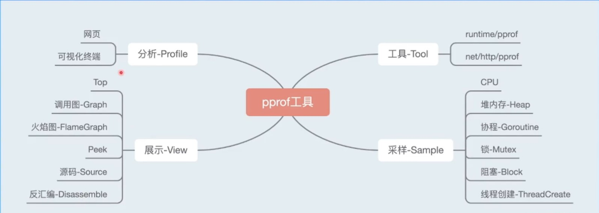
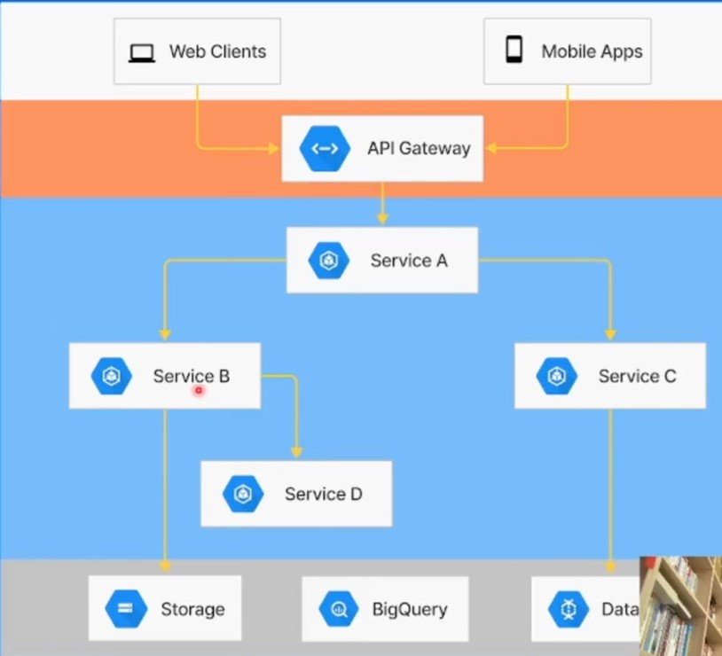

# 高质量编程与性能调优实践

## 01 高质量编程

### 1.1 简介

- 什么是高质量编程？-> 编写的代码能够达到**正确可靠、简洁清晰**的目标可称之为高质量代码。
  - 各种边界条件是否考虑完备
  - 异常情况处理，稳定性保证
  - 易读易维护
- 编程原则：
  - **简单性**：
    - 消除“多余的复杂性”，以简单清晰的逻辑编写代码
    - 不理解的代码无法修复改进
  - **可读性**：
    - 代码是写给人看的，而不是机器
    - 编写可维护代码的第一步是确保代码可读
  - **生产力**：
    - 团队整体工作效率非常重要

### 1.2 编码规范

- 编程规范是很重要的一部分，好的代码规范编写习惯可以提高个人工作的效率，甚至可以让人一眼看出正经科班和野路子的区别。

- 如何编写高质量的 Go 代码：

  - **代码格式**：推荐使用 `gofmt` 自动格式化代码。

    - `gofmt`：`Go` 语言官方提供的工具，能自动格式化 `Go` 语言代码为官方统一风格。

      常见 `IDE` 都支持方便的配置。

  - **注释**：注释应该做的：

    - 注释应该**解释代码作用**。
    - 注释应该**解释代码如何做的**。
    - 注释应该解释代码实现的原因：**提供额外的上下文**。
    - 注释应该**解释代码什么情况会出错**。

  - **命名规范**：

    - 简洁胜于冗长。
    - 缩略词全大写，但当其位于变量开头且不需要导出时，使用全小写：
      - 例如使用 `ServerHTTP` 而不是 `ServerHttp`
      - 使用 `XMLHTTPRequest` 或者 `xmlHTTPRequest` 
    - **变量名**距离其被使用的地方越远，则需要携带越多的上下文信息。
    - **函数名**不携带包名的上下文信息，因为包名和函数名总是成对出现的。
    - **包名**只由小写字母组成，不包含大写字母和下划线等字符，且不要与标准库同名。

  - **控制流程**

    - 线性原理，处理逻辑尽量走直线，避免复杂的嵌套分支，保持正常流程清晰。
    - 尽量保持正常代码路径为最小缩进。**优先处理错误情况/特殊情况，尽早返回或继续循环来减少嵌套**。

  - **错误和异常处理**

    - 简单错误（仅出现一次，且在其他地方不需要捕获的错误）优先使用 `errors.New` 来创建匿名变量来直接表示简单错误。
    - 判定一个错误是否为特定错误，可以使用 `errors.Is` 。
    - `defer` 语句会在函数返回前调用，多个 `defer` 语句是后进先出。

### 1.3 性能优化建议

- 性能优化的前提是满足正确可靠、简洁清晰等质量因素。

  性能优化是综合评估，有时候时间效率和空间效率可能对立。

#### slice

- `slice` 预分配内存：尽可能在使用 `make()` 初始化切片时提供容量信息。

  这样可以降低程序执行时间，减少内存分配次数。 -> 为什么？

  - 我们要从 `slice` 的本质进行分析：
    - 切片本质是一个数组片段的描述，包括：数组指针、片段的长度、片段的容量。
    - 切片操作并不复制切片指向的元素
    - 创建一个新的切片会复用原来切片的底层数组

#### map

- `map` 预分配内存：和 `slice` 类似。
  - 不断向 `map` 中添加元素的操作会触发 `map` 的扩容
  - 提前分配好空间可以减少内存拷贝和 `Rehash` 的消耗
  - 建议根据实际需求提前预估好需要的空间

#### strings.Builder

- 在进行字符串的拼接时，使用 `+` 拼接性能最差，`strings.Builder`，`bytes.Buffer` 相近，`strings.Builder` 更快。

  原因在于：

  - 字符串在 `Go` 语言中是不可变类型，占用内存大小是固定的
  - 使用 `+` 每次都会重新分配内存
  - `strings.Builder`，`bytes.Buffer` 底层都是 `[]byte` 数组，根据其内存扩容策略，不需要每次拼接时重新分配内存。

#### 空结构体

- 通过使用空结构体来节省内存：
  - 空结构体 `struct{}` 实例不占据任何内存空间。因此可作为各种场景下的占位符使用。

#### atomic包

- 在多线程中，使用 `atomic` 包，相对于锁来说，性能更优。
  - 锁的实现是通过操作系统来实现，属于系统调用
  - `atomic` 操作是通过硬件实现，效率比锁高
  - `sync.Mutex` 应该用来保护一段逻辑，不仅仅用于保护一个变量
  - 对于非数值操作，可以使用 `atomic.Value`，能承载一个 `interface{}` 

## 02 性能调优实战

### 2.1 简介

- 性能调优原则：
  - 要依靠数据不是猜测。
  - 要定位最大瓶颈而不是细枝末节。
  - 不要过早优化。
  - 不要过度优化。

### 2.2 性能分析工具pprof

- `pprof` 是用于可视化和分析性能分析数据的工具。

#### 2.2.1 功能图

#### 2.2.2 排查实战

- 利用 `pprof` 进行性能优化的实战可以根据

  [wolfogre/go-pprof-practice](https://github.com/wolfogre/go-pprof-practice)、[golang pprof 实战 | Wolfogre's Blog](https://blog.wolfogre.com/posts/go-ppof-practice/) 

  来进行操作学习。

#### 2.2.3 采样过程和原理

##### CPU

- 采样对象：函数调用和它们占用的时间。
- 采样率：100次/秒，固定值。
- 采样时间：从手动启动到手动结束。

##### Heap-堆内存

- 采样程序通过内存分配器在堆上分配和释放的内存，记录分配/释放的大小和数量
- 采样率：每分配 `512KB` 记录一次，可在运行开头修改，1 为每次分配均记录
- 采样时间：从程序运行开始到采样时
- 采样指标：`alloc.\_space`、`alloc_.objects`、`inuse_space`、`inuse_objects`
- 计算方式：`inuse = alloc - free` 

##### Goroutine&ThreadCreate

- `Goroutine`：记录所有用户发起且在运行中的 `goroutine` 。
- `ThreadCreate`：记录程序创建的所有系统线程的信息。

##### Block&Mutex

- 阻塞`Block`：
  - 采样阻塞操作的次数和耗时
  - 采样率：**阻塞耗时超过阈值的才会被记录**，1 为每次阻塞均记录
- 锁`Mutex`：
  - 采样争抢锁的次数和耗时
  - 采样率：只记录固定比例的锁操作，1 为每次加锁均记录

### 2.3 性能调优案例

#### 业务服务优化

- 基本概念：

  - **服务**：能单独部署，承载一定功能的程序
  - **依赖**：`Service A` 的功能实现依赖 `Service B` 的响应结果，称为 `Service A` 依赖 `Service B` 
  - **调用链路**：能支持一个接口请求的相关服务集合及其相互之间的依赖关系
  - **基础库**：公共的工具包、中间件

  

- 流程：
  - 建立服务性能评估手段
  - 分析性能数据，**定位性能瓶颈**
    - 使用库不规范
    - 高并发场景优化不足
  - 重点优化项改造
    - 正确性是基础
  - 优化效果验证：
    - 重复压测验证
    - 上线评估优化效果

#### 基础库优化

- 分析基础库核心逻辑和性能瓶颈
  - 设计完善改造方案
  - 数据按需获取
  - 数据序列化协议优化
- 内部压测验证
- 推广业务服务落地验证

#### Go语言优化

- 编译器&运行时优化：
  - 优化内存分配策略
  - 优化代码编译流程，生成更高效的程序
  - 内部压测验证
  - 推业务服务落地验证